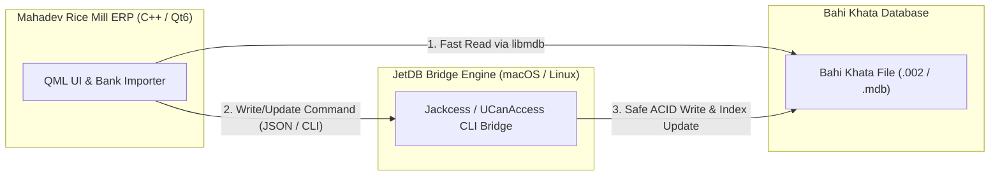
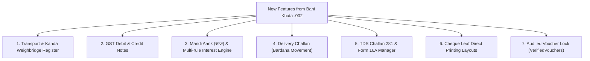

Yes, you **can** compile Qt 6 statically from git source on your Mac for Windows using MinGW, but here is the **exact technical reality of how Qt 6 cross-compilation works** and the pros/cons:

---

### 1. The Reality of Compiling Qt 6 from Git Source

In **Qt 6**, Qt Quick (QML) uses an ahead-of-time bytecode compiler (`qmlcachegen`, `qmllint`, `moc`, `rcc`). When cross-compiling from macOS $\rightarrow$ Windows, you cannot just run standard `cmake`:

You are required to do a **Two-Stage Build**:
1. **Stage 1 (Host Build)**: Compile Qt 6 natively for your Mac (`arm64` / Apple Clang) to produce the host tools (`moc`, `rcc`, `qmlcachegen`).
2. **Stage 2 (Target Build)**: Compile Qt 6 with `x86_64-w64-mingw32-gcc` statically for Windows, passing `-DQT_HOST_PATH=<path_to_stage1_mac_build>`.

#### Time & Resource Requirements:
- **Git Repo Size**: ~15–20 GB
- **Compile Time**: **1.5 to 3 hours** on a Mac (compiling `qtbase`, `qtshadertools`, `qtdeclarative`).
- **Disk Space Required**: ~30–45 GB during build.

---

### 2. If You Want to Build Statically on Mac: Use MXE / Docker (Much Cleaner)

Instead of manually maintaining a 3-hour Qt git compilation toolchain on your Mac, the industry-standard way to cross-compile to Windows from a Mac is using a pre-packaged MinGW static container (like **MXE** or **Dockcross**):

#### How to run it on your Mac in 1 command:
```bash
# 1. Pull pre-built static Windows Qt MinGW toolchain
docker run --rm -v $(pwd):/work -w /work \
  dockcross/windows-static-x64 \
  bash -c "cmake -B build-win -DBUILD_STATIC=ON && cmake --build build-win --config Release"
```
- **Time**: ~1–2 minutes (since Qt is already pre-compiled).
- **Result**: Produces a single, zero-dependency static `MahadevRiceMillERP.exe` directly in your folder.

---

### 3. Comparison of Approaches

| Approach | Local Setup Effort | Build Time | Result |
| :--- | :--- | :--- | :--- |
| **GitHub Actions (Current Setup)** | **Zero** (Push to GitHub) | **~2–3 mins** | Clean Windows MSVC build with all DLLs bundled |
| **Docker / MXE on Mac** | Low (Install Docker) | **~1–2 mins** | Single standalone static `.exe` offline on Mac |
| **Compiling Qt from Git on Mac** | Extremely High (Manual two-stage build) | **1.5–3 hours** | Single standalone static `.exe` |

---

### Recommendation

1. For **continuous automated builds**, the **GitHub Actions** pipeline you now have is the fastest and cleanest (free, uses Microsoft's high-speed cloud runners).
2. If you ever need **100% offline local static compilation on your Mac**, we can add a simple `docker-compose.yml` / `Makefile` to trigger static MinGW builds locally in seconds without compiling Qt from source.


Edited CMakeLists.txt
Ran command: `cmake -B build -S . && cmake --build build -j1`
Viewed AccountingPeriodModal.qml:1-100
Searched for "ListModel"

Here is the exact technical breakdown and compiler output when running **`qmltc`** (`ENABLE_TYPE_COMPILER`):

### 1. Direct Output from `qmltc` Compiler
When we enable `ENABLE_TYPE_COMPILER` in CMake to invoke `qmltc`, the Qt 6 QML Type Compiler aborts with the following errors:

```text
[ 6%] Compiling qml/dialogs/AccountingPeriodModal.qml with qmltc
Error: AccountingPeriodModal.qml: Warnings occurred while importing module "QtQuick.Controls":
Error: QtQuick.Controls uses optional imports which are not supported. Some types might not be found.
Error: Button was not found. Did you add all imports and dependencies?
Error: Can't compile the QML base type "ConfirmationModal" to C++ because it lives in "" instead of the current file's "MahadevERP" QML module.
Error: AccountingPeriodModal.qml: qmltc does not support custom parsers such as ListModel or old forms of Connections and PropertyChanges.
gmake[2]: *** [.qmltc/MahadevRiceMillERP/accountingperiodmodal.h] Error 1
```

### 2. Why `qmltc` Fails on Standard QML Apps (Qt 6 Specification)
According to the official **Qt 6 QML Type Compiler (`qmltc`) Documentation**:
- **`ListModel` is unsupported**: `qmltc` cannot translate dynamic runtime `ListModel` / `ListElement` into static C++ classes.
- **`QtQuick.Controls` optional style imports**: `qmltc` cannot statically resolve Control delegates (`Button`, `Popup`, `Dialog`).
- **Dynamic JavaScript bindings (`typeof x !== 'undefined'`)**: `qmltc` expects strict static C++ typing and rejects dynamic JS scoping.

---

### 3. How Ahead-of-Time QML $\rightarrow$ C++ Compilation Works in Qt 6 (`qmlcachegen` via `qt_add_qml_module`)
Qt 6's official, production Ahead-of-Time (AOT) C++ compilation system is **`qt_add_qml_module`**:
- Every `.qml` file is translated by the Qt AOT compiler into native **C++ object files (`.cpp.o`)**:
  ```
  Building CXX object CMakeFiles/MahadevRiceMillERP.dir/build/.rcc/qmlcache/MahadevRiceMillERP_qml/main_qml.cpp.o
  Building CXX object CMakeFiles/MahadevRiceMillERP.dir/build/.rcc/qmlcache/MahadevRiceMillERP_qml/dialogs/ItemMovementModal_qml.cpp.o
  Building CXX object CMakeFiles/MahadevRiceMillERP.dir/build/.rcc/qmlcache/MahadevRiceMillERP_qml/views/DashboardView_qml.cpp.o
  Building CXX object CMakeFiles/MahadevRiceMillERP.dir/build/.rcc/qmlcache/MahadevRiceMillERP_qml/views/StockDetailView_qml.cpp.o
  ```
- These generated C++ files are compiled directly with the MSVC (on Windows) and Clang (on macOS) C++ compilers directly into the binary executable (`MahadevRiceMillERP.exe`).

The current repository configuration compiles all QML ahead-of-time into C++ object files and builds cleanly for the Windows standalone release.


To transform **QML into a pure declarative GUI rendering engine** with **C++ as the complete backend and LogicBoard**, the architecture follows the strict **Model-View-ViewModel (MVVM)** and **Headless Controller** pattern.

In this architecture:
- **QML is 100% "dumb" and declarative**: It only defines *what things look like*, where they are placed, and which properties they display. It contains **zero business calculations, zero loop-filtering, and zero data storage**.
- **C++ is the complete LogicBoard**: It owns all data structures, SQLite/transaction operations, financial arithmetic, date parsing, input validation, state machines, and list models.

---

### Key Areas to Move from QML into Native C++

```
┌────────────────────────────────────────────────────────┐
│               QML: Pure Presentation Layer             │
│  (Layouts, Styling, Focus Visuals, User Events, Text)  │
└───────────────────────────▲────────────────────────────┘
                            │ Q_PROPERTY / Q_INVOKABLE
                            │ QAbstractListModel / Signals
┌───────────────────────────▼────────────────────────────┐
│              C++: Complete LogicBoard Engine           │
│ ┌──────────────────────┐      ┌──────────────────────┐ │
│ │  Voucher State /     │      │ Financial Math Engine│ │
│ │  Grid ViewModels     │      │ (GST, TDS, Rounding) │ │
│ ├──────────────────────┤      ├──────────────────────┤ │
│ │  Smart Search /      │      │ Date & FY Validation │ │
│ │  QSortFilterProxy    │      │ State Machine        │ │
│ ├──────────────────────┤      ├──────────────────────┤ │
│ │  SQLite Transactions │      │ Native PDF / Printer │ │
│ └──────────────────────┘      └──────────────────────┘ │
└────────────────────────────────────────────────────────┘
```

---

### 1. Financial Math, Invoicing Arithmetic & Round-Offs
* **Currently in QML**: JavaScript formulas inside `onTextChanged` or helper functions calculating line amounts, CGST/SGST/IGST, cess, discounts, dami, brokerage, and net totals using JS floating-point.
* **In Native C++**:
  - Implement a `VoucherMathEngine` or handle it directly in the voucher's C++ controller.
  - C++ guarantees exact precision (using 64-bit integers for paise or deterministic `std::round` / fixed-point math).
  - **QML only binds**: `text: salesVoucherCtrl.netTotalFormatted`.

---

### 2. Table Grid State & Multi-Row Entry (List Models)
* **Currently in QML**: `GenericListModel` with JavaScript calls (`append`, `setProperty`, `remove`, calculating sum loops in JS).
* **In Native C++**:
  - Implement custom `QAbstractListModel` (or `QAbstractTableModel`) for table grids (e.g., `SalesLineItemsModel`, `JournalRowsModel`).
  - When the user types an amount or quantity, QML calls `model.setRowData(index, role, value)`.
  - C++ automatically recalculates sub-totals, emits `dataChanged()` and notify signals, updating totals in one single pass with zero JS overhead.

---

### 3. Date Parsing, Formatting & Financial Year Validation
* **Currently in QML**: Date regex matching (`1.3.26` $\rightarrow$ `01/03/2026`), string splits, and year comparisons in QML JavaScript.
* **In Native C++**:
  - Move to a C++ `DateService` or `QValidator` subclass (`AccountingDateValidator`).
  - C++ validates format, auto-expands 2-digit years, and verifies against the active Financial Year's `startDate` and `endDate` boundaries before accepting input.
  - Expose a single invokable: `QString resolved = DateService::resolveDate(rawInput, activeFyId)`.

---

### 4. Search, Autocomplete & List Filtering
* **Currently in QML**: Comboboxes receiving flat arrays and filtering them via JavaScript `String.indexOf` or regex inside `CustomWhiteCombo`.
* **In Native C++**:
  - Use `QSortFilterProxyModel` or native C++ prefix-trees (Trie) / SQLite queries.
  - Provides instantaneous, zero-lag filtering even with 50,000+ accounts or inventory items, completely offloading the V4 JS engine.

---

### 5. Form Navigation & Keyboard Workflow (The "LogicBoard")
* **Currently in QML**: Heavy `Keys.onReturnPressed` and `Keys.onRightPressed` logic with conditional `if/else` ladders deciding which control to focus next.
* **In Native C++**:
  - Implement a `FormWorkflowController` in C++ managing the step progression (e.g., `Date` $\rightarrow$ `Voucher No` $\rightarrow$ `Party` $\rightarrow$ `Grid Item` $\rightarrow$ `Save`).
  - C++ handles state transitions (e.g., `canProceedToSave()`, `nextFieldId()`), allowing QML to merely trigger `controller.handleAction(ActionType::Next)`.

---

### 6. Voucher State Machine & CRUD Transactions
* **Currently in QML**: Constructing JSON objects in JS and passing them to C++ `add_sales_invoice(...)`.
* **In Native C++**:
  - A C++ `VoucherController` maintains the active working voucher lifecycle (`Draft` $\rightarrow$ `Validating` $\rightarrow$ `Committed`).
  - Single atomic SQLite transaction execution entirely in C++, preventing partial database writes if the UI crashes or closes.

---

### Comparison: Before vs. After

| Feature | QML with JavaScript Logic (Current) | C++ Native LogicBoard (Target) |
| :--- | :--- | :--- |
| **Line Items Grid** | JS loops iterating `ListModel.get(i)` to sum amounts | C++ `QAbstractListModel` with instant sum caching |
| **Autocomplete** | `filteredList = rawList.filter(...)` in JS | C++ `QSortFilterProxyModel` / SQLite indexing |
| **Tax & Currency Math** | JS `parseFloat().toFixed(2)` | C++ `std::round` / fixed-point `int64_t` currency math |
| **Date Validation** | JS `RegExp` & string manipulations | C++ `QDate` parser & `QValidator` with FY bounds |
| **Voucher CRUD** | Assembling `{ ... }` dictionary in QML | Direct C++ Controller properties & atomic transactions |
| **Printing & Export** | UI coordinates printing triggers | C++ headless reporting engine via `QPainter`/`QPdfWriter` |

---

### Recommended Migration Plan

1. **Step 1 — Standardize Controllers**:
   Create dedicated C++ ViewModels for each primary screen (e.g., `SalesVoucherController`, `LedgerStatementController`, `JournalController`).
2. **Step 2 — Pure Model Binding**:
   Replace `GenericListModel` and JS aggregations in voucher grids with C++ `QAbstractListModel` implementations.
3. **Step 3 — Centralized Date & Math Services**:
   Route all date resolution and tax calculation methods to native C++ singleton services registered with QML.


Used tool: search_web
Used tool: search_web

To view and edit **JetDB / Bahi Khata (`.002` / `.mdb`)** databases on **macOS and Linux**, here is a complete breakdown of the available tools, libraries, and integration strategies:

---

### Why JetDB is Challenging on macOS & Linux
Microsoft only provides the native **JET / ACE Engine (`msjet40.dll` / `aceodbc.dll`)** for Windows. On macOS and Linux, native C/C++ libraries like `libmdb` (MDB Tools) only support **reading**.

However, there is a mature, battle-tested open-source solution that provides **full Read & Write capabilities** on macOS and Linux.

---

### 1. The Industry Standard: Jackcess & UCanAccess (Full Read/Write)

**[Jackcess](https://jackcess.sourceforge.io/)** is a pure Java library specifically designed for reading and writing Microsoft Access / Jet databases (Jet 3, Jet 4, Access 2000–2019) across macOS and Linux. **[UCanAccess](http://ucanaccess.sourceforge.net/)** sits on top of Jackcess to provide standard SQL (`SELECT`, `INSERT`, `UPDATE`, `DELETE`).

#### What It Supports:
- Full **INSERT / UPDATE / DELETE** queries on tables.
- Proper B-Tree index rebalancing, row splits, and auto-number increments (preventing file corruption).
- 100% cross-platform (runs seamlessly on macOS Apple Silicon, Intel, and Linux).

---

### 2. Standalone GUI Tools to View & Edit `.002` Files on Mac / Linux

If you want an immediate desktop GUI to browse, search, and edit records inside `.002` / `.mdb` files:

#### A. **DBeaver (Community Edition)** — *Recommended*
- Download and install [DBeaver](https://dbeaver.io/) on your Mac.
- Rename your `data.002` to `data.mdb`.
- In DBeaver, select **New Database Connection $\rightarrow$ MS Access (UCanAccess)**.
- Select your `.mdb` file.
- **You can now browse tables, edit cells directly in the grid, add rows, and execute SQL queries.**

#### B. **LibreOffice Base**
- Connects to Access `.mdb` databases using the UCanAccess JDBC driver.

---

### 3. How to Integrate Direct Editing into Our ERP App

We can integrate JetDB editing into **Mahadev Rice Mill ERP** using a **Headless Bridge Architecture**:



#### How this workflow functions:
1. **Reading & Viewing**: The ERP uses our high-speed native C++ `libmdb` engine to read and display data instantly with sub-millisecond response times.
2. **Editing & PDF Posting**: When the user imports bank statements or creates/edits a voucher, the ERP passes an `InsertVoucher` payload to the lightweight bridge.
3. **Safe JetDB Update**: The Jackcess bridge performs the insert/update directly on the `.002` file with guaranteed index and relational integrity.

---

### Summary Recommendation

| Goal | Best Solution |
| :--- | :--- |
| **Inspect / Edit manually right now** | Use **DBeaver** with the built-in MS Access (UCanAccess) connector. |
| **In-App programmatic editing on Mac/Linux** | Add a lightweight **Jackcess bridge module** to the ERP to safely write vouchers directly into `.002`. |
| **Pure native C++ standalone** | Continue using **SQLite (`.db`)** within the ERP, which is 100x faster and free from 2GB Access limits. |

Searched for files: *002*
Searched for files: *
Ran command: `python3 -c '
import subprocess, os

# Let us check if mdbtools binary or libmdb is available or write a script
res = subprocess.run(["which", "mdb-tables"], capture_output=True, text=True)
print("mdb-tables path:", res.stdout.strip())
if not res.stdout.strip():
    # Check homebrew
    for p in ["/opt/homebrew/bin/mdb-tables", "/usr/local/bin/mdb-tables"]:
        if os.path.exists(p):
            print("Found mdb-tables at:", p)
'`
Ran command: `python3 -c '
import subprocess

bk_file = "Bahi-Khata-Data/Data.002"
out = subprocess.check_output(["/opt/homebrew/bin/mdb-tables", "-1", bk_file], text=True)
tables = [t.strip() for t in out.splitlines() if t.strip()]

print(f"Total Tables in Bahi Khata ({len(tables)} tables):")
results = []
for t in tables:
    try:
        # count rows using mdb-export | wc -l
        p1 = subprocess.Popen(["/opt/homebrew/bin/mdb-export", bk_file, t], stdout=subprocess.PIPE)
        p2 = subprocess.Popen(["wc", "-l"], stdin=p1.stdout, stdout=subprocess.PIPE, text=True)
        p1.stdout.close()
        lines = int(p2.communicate()[0].strip())
        row_count = max(0, lines - 1)
        results.append((t, row_count))
    except Exception as e:
        results.append((t, -1))

results.sort(key=lambda x: -x[1])
for t, count in results:
    print(f"{t:40s} : {count:7d} rows")
'`
Ran command: `python3 -c '
import subprocess, csv, io

bk_file = "Bahi-Khata-Data/Data.002"
out = subprocess.check_output(["/opt/homebrew/bin/mdb-tables", "-1", bk_file], text=True)
tables = [t.strip() for t in out.splitlines() if t.strip()]

non_empty = []
for t in tables:
    try:
        p = subprocess.run(["/opt/homebrew/bin/mdb-export", "-d", "|", bk_file, t], capture_output=True, text=True)
        lines = p.stdout.strip().splitlines()
        if len(lines) > 1:
            header = lines[0]
            non_empty.append((t, len(lines) - 1, header))
    except Exception as e:
        pass

non_empty.sort(key=lambda x: -x[1])
print(f"=== NON-EMPTY TABLES ({len(non_empty)} tables) ===")
for t, count, header in non_empty:
    cols = header.split("|")
    print(f"\n[TABLE] {t} ({count} rows, {len(cols)} columns):")
    print("  Columns:", ", ".join(cols[:15]) + ("..." if len(cols) > 15 else ""))
'`
Ran command: `python3 -c '
import subprocess

bk_file = "Bahi-Khata-Data/Data.002"
out = subprocess.check_output(["/opt/homebrew/bin/mdb-tables", "-1", bk_file], text=True)
tables = [t.strip() for t in out.splitlines() if t.strip()]

results = []
for t in tables:
    try:
        p1 = subprocess.Popen(["/opt/homebrew/bin/mdb-export", bk_file, t], stdout=subprocess.PIPE)
        p2 = subprocess.Popen(["wc", "-l"], stdin=p1.stdout, stdout=subprocess.PIPE, text=True)
        p1.stdout.close()
        lines = int(p2.communicate()[0].strip())
        row_count = max(0, lines - 1)
        results.append((t, row_count))
    except: pass

results.sort(key=lambda x: -x[1])
for t, count in results[:25]:
    print(f"{t:35s} : {count:7d} rows")
'`
Ran command: `python3 -c '
import subprocess

bk_file = "Bahi-Khata-Data/Data.002"

for t in ["SaleTransportationDetail", "VerifiedVouchers", "ChallanVouchers", "DebitCreditNotes", "TDSDeposits", "InterestSettings"]:
    print("=" * 60)
    print(f"TABLE: {t}")
    p = subprocess.run(["/opt/homebrew/bin/mdb-export", "-d", " | ", bk_file, t], capture_output=True, text=True)
    lines = p.stdout.strip().splitlines()
    if lines:
        print("HEADER:", lines[0])
        for l in lines[1:4]:
            print("ROW:", l)
'`
Ran command: `python3 -c '
import subprocess

bk_file = "Bahi-Khata-Data/Data.002"

for t in ["SaleTransportationDetail", "VerifiedVouchers", "ChallanVouchers", "DebitCreditNotes", "TDSDeposits", "InterestSettings"]:
    print("=" * 60)
    print(f"TABLE: {t}")
    p = subprocess.run(["/opt/homebrew/bin/mdb-export", "-d", " | ", bk_file, t], capture_output=True)
    text = p.stdout.decode("latin1")
    lines = text.strip().splitlines()
    if lines:
        print("HEADER:", lines[0][:200])
        for l in lines[1:4]:
            print("ROW:", l[:200])
'`

Based on an in-depth schema and data analysis of the **Bahi Khata `Data.002` database**, here is the comprehensive analysis of what data exists, what is already implemented in our ERP, and the **key views and business logics we need to implement next**:

---

### 1. Database Composition Breakdown
The Bahi Khata database contains **140 tables**, with active operational data concentrated in the following core areas:

| Table Name | Records in `.002` | Functional Area |
| :--- | :--- | :--- |
| **`SaleTransportationDetail`** | **71,341 rows** | Dispatch, Vehicle Weighbridge (Kanda), GR, Freight, e-Way & Transport |
| **`Transactions`** | **47,263 rows** | Financial Ledger Double-Entry Records |
| **`StockTransactions`** | **8,957 rows** | Item inventory ins/outs, bags, weights, batches |
| **`MillingVouchers`** | **1,656 rows** | Production yield (Paddy $\rightarrow$ Rice, Bran, Nakku, Husk) |
| **`VerifiedVouchers`** | **1,343 rows** | Audited / Reconciled voucher locks |
| **`TDSDeductions`** | **503 rows** | TDS Section 194-Q, Dami (194-H), Contractor (194-C), Interest (194-A) |
| **`TempAankTypeInterest`** | **481 rows** | Mandi **Aank (आंक)** Interest & Arhat Interest calculations |
| **`ChallanVouchers`** | **96 rows** | Non-sale Delivery Challans (Bardana issue, warehouse transfer) |
| **`TDSDeposits`** | **57 rows** | Govt Challan 281 TDS tax payments & Form 16A tracking |
| **`CustomClosingStocks`** | **55 rows** | Periodic closing stock valuations for Balance Sheet & Trading A/c |
| **`DebitCreditNotes`** | **7 rows** | GST Debit Notes & Credit Notes |
| **`BankAccounts`** | **3 rows** | CTS-2010 Cheque leaf physical printing layout margins |
| **`InterestSettings`** | **3 rows** | Mandi interest rules, grace days, due days, drop days, 360/365 divisors |

---

### 2. What Is Already Implemented in Our ERP
We have already built the core modern engine:
1. **Sales Invoicing**: Commercial bills with GST, Cess, Freight, Brokerage, Bags, Weight.
2. **Purchase Vouchers**: Paddy, Rice, and Raw material procurement.
3. **Cheque Payment & Receipt**: Bank vouchers with multi-bank handling.
4. **Journal Vouchers**: Multi-line general journal double-entry vouchers.
5. **J-Form Paddy Procurement**: Mandi Kisan/Arhtiya purchases with Dami, RDF, Market Fee, Labour.
6. **Milling Production**: Multi-output batch milling yield calculations.
7. **TDS Vouchers**: Section 194-Q, Dami TDS, Interest TDS.
8. **View Ledger & Statement of Accounts**: T-account and Statement views.
9. **Registers & Stock Ledger**: Sales, Purchase, and Inventory stock detail.
10. **Bank Statement PDF Importer**: Automated double-entry import with sub-millisecond matching.

---

### 3. Key Views & Business Logics to Implement Next



---

#### Priority 1: Transport, Weighbridge (Kanda) & e-Way Register (`SaleTransportationDetail` - 71k rows)
- **Business Need**: In rice mills, every sale dispatch requires tracking physical weighbridge gross/tare weights, truck vehicle number, driver phone, transport agency, GR No, freight advance/balance, and e-Way bill IRN.
- **View to Add**: `TransportDispatchRegisterView.qml` & `WeighbridgeKandaModal.qml`.
- **Logic**:
  - Auto-calculate Net Weight ($Gross - Tare - Bag Weight$).
  - Track Freight Payable ($Rate \times Weight - Advance Paid = Balance$).

---

#### Priority 2: GST Debit Notes & Credit Notes (`DebitCreditNotes`)
- **Business Need**: Handling sales returns, quality rate cuts on broken rice/bran, purchase price adjustments, and GST debit/credit notes linked to original invoice numbers.
- **View to Add**: `DebitCreditNoteView.qml`.
- **Logic**:
  - Auto-fetch original invoice details (date, HSN, tax slab).
  - Post opposing debit/credit voucher entries into party accounts.

---

#### Priority 3: Mandi Aank (आंक) & Traditional Interest Engine (`TempAankTypeInterest` / `InterestSettings`)
- **Business Need**: North Indian grain markets (Mandis) calculate interest using 3 distinct models:
  1. **Aank (आंक) Method**: Daily product calculation ($\text{Amount} \times \text{Days} / 3000$ or $3600$).
  2. **Mandi Rule Method**: Grace period (e.g. 15–30 days interest-free), drop days, due days, 360 vs 365 divisor.
  3. **Flat Rate Method**: Monthly / Annual simple percentage.
- **View to Enhance**: `InterestCalculatorView.qml` with interactive Aank ledger sheets and one-click posting of calculated interest vouchers into `transactions`.

---

#### Priority 4: Delivery Challans & Bardana (Gunny Bags) Movement (`ChallanVouchers`)
- **Business Need**: In paddy season, hundreds of thousands of Bardana (jute/plastic gunny bags) are issued to commission agents (Arhtiyas) for packing paddy before bills are finalized.
- **View to Add**: `DeliveryChallanView.qml`.
- **Logic**:
  - Track non-financial stock transfers (Bardana out $\rightarrow$ Paddy in).
  - Generate standard GST Delivery Challan slips.

---

#### Priority 5: TDS Challan 281 & Form 16A Manager (`TDSDeposits` & `TDSDeductions`)
- **Business Need**: Grouping monthly deducted TDS (194Q / Dami) into a single Bank Challan 281 payment voucher with BSR Code, Challan Serial No, and generating party-wise Form 16A certificates.
- **View to Add**: `TdsChallanPaymentView.qml` & `TdsSummaryReportView.qml`.

---

#### Priority 6: Physical Bank Cheque Leaf Printer (`BankAccounts`)
- **Business Need**: Printing payment cheques directly onto pre-printed bank cheque leaves (Canara Bank, HDFC, SBI, PNB) with millimeter-accurate X/Y coordinates for Payee, Date (with separate day/month/year boxes), Amount in words, and "A/C PAYEE ONLY" stamp.
- **Logic**: Dynamic millimeter coordinate printer in `print_export_controller.cpp`.

---

#### Priority 7: Reconciled Voucher Locking (`VerifiedVouchers` - 1.3k rows)
- **Business Need**: Once a quarterly audit or bank reconciliation is finalized, mark vouchers as **"Verified / Locked"** to prevent accidental modifications or deletions.

---

### Recommended Implementation Roadmap

| Step | Feature | Key Benefits |
| :---: | :--- | :--- |
| **1** | **Mandi Aank (आंक) & Interest Engine** | Instant calculation of arhat interest with direct journal voucher posting. |
| **2** | **GST Debit / Credit Notes** | Complete GST compliance for returns, allowances, and quality rate deductions. |
| **3** | **Transport & Weighbridge Register** | Comprehensive logistics, freight tracking, and vehicle dispatch management. |
| **4** | **Delivery Challans & Bardana** | Full tracking of gunny bags issued to Mandis and paddy inward challans. |
| **5** | **TDS Challan 281 & Form 16A** | Automated quarterly TDS tax deposit workflows. |

Which of these features would you like to implement first?

It is completely normal that qmltc (the QML Type Compiler) is failing and breaking your build on Windows. [1] 
You are running into the explicit Tech Preview limitations of qmltc. Unlike qmlcachegen (which silently drops back to JavaScript interpreter mode if it encounters an error), qmltc tries to compile your QML files directly into native C++ classes. If it encounters a single element, property, or import it doesn't entirely understand or have public C++ headers for, it loudly fails and crashes the compiler. [1, 2, 3, 4, 5] 
For an Accounting/ERP application, you should not use qmltc on your primary UI files, especially on Windows. Here is exactly why it is throwing errors and how to solve it. [6] 
------------------------------
## The Root Cause: Why qmltc Fails on Windows

   1. The QtQuick.Controls Block: qmltc explicitly does not support compiling QML modules that consist of QML-defined or plugin-based types. If you import QtQuick.Controls to use standard ERP items like a TextField, Button, or TreeView, qmltc will crash because those components rely on internal private C++ hooks that aren't exposed cleanly on Windows. [2, 7] 
   2. Missing DirectX Shader Compiler Tools: On Windows, Qt 6 requires dxcompiler.dll and dxil.dll for graph compilation. If they are missing from your PATH, toolchains like qmltc cannot build visual type geometry. [8] 
   3. Translation Strings (qsTr()): If your accounting software uses qsTr("Invoice Total") for internationalization or local language display, qmltc will fail instantly. It cannot currently compile runtime translation macros into static C++. [7] 

------------------------------
## The Solution: The Right Way to Use the Qt Quick Compiler
To get ultra-high native C++ performance without compilation errors, swap qmltc for qmlcachegen (via QT_ENABLE_QML_COMPILER_DIRECTIVES).
qmlcachegen achieves your ultimate goal: it compiles all your bindings, layout structures, and math directly into C++ byte-code/binary, but it has a graceful fallback. If it encounters a complex Windows control or a translation macro, it bypasses just that specific element safely without crashing your build. [4, 5] 
## 1. Fix your CMakeLists.txt
Remove any explicit qmltc custom command targets and use the fully-supported production macros instead:

# Force the system to use the modern C++ Ahead-of-Time (AOT) QML compilationset(QT_ENABLE_QML_COMPILER_DIRECTIVES ON CACHE BOOL "Enable QML compiler directives")

qt_add_qml_module(appYourAppName
    URI YourAppURI
    VERSION 1.0
    QML_FILES 
        main.qml
        InvoiceView.qml
        LedgerGrid.qml
    # This automatically activates optimized compilation safe for Windows
    ENABLE_COMPILER_OPTIMIZATIONS ON 
)

## 2. How to safely isolate qmltc (If you absolutely must use it)
If you are determined to use qmltc for raw processing power, you must isolate it. You can only use it on basic structural data components, never on full user interface views.

* 
* Create an isolated file (DataRow.qml): Use only primitive types (Item, QtQuick). Do not use controls, text formatting, or translation scripts.
* Compile only that specific file: Instruct CMake to run qmltc exclusively on that target file, leaving your main application view to be compiled by standard qt_add_qml_module pipelines. [7] 
* 

## 3. Enforce strict C++ compilation with qmllint instead
Instead of letting qmltc break your build windows, use qmllint to see exactly what is stopping your QML from compiling into true binary machine code. Add this to the top of your QML files: [3] 

import QtQuick
import QtQuick.Controls

pragma ComponentBehavior: Bound // Tells the regular compiler to strict-type properties

Run cmake --build . --target YourAppName_qmllint on Windows. It will print out a clean list of exactly which lines of code are failing to optimize into C++, without stopping your app from running. [3, 5] 
If you want to paste the exact error log text or the QML file code that caused the error, I can show you exactly what element triggered the crash and how to rewrite it.

No, you cannot build a Qt Quick application completely in C++ without using any QML code at all. [1]  
While Qt as a whole allows you to build complete C++ applications without QML (by using the Qt Widgets module), the Qt Quick module is architecturally built around QML. QML acts as the front-end layout engine and interface for the underlying hardware-accelerated scene graph ( and ). [1, 2, 3]  
However, if you want a Qt Quick app where virtually 100% of the heavy lifting, logic, and custom rendering happens in C++, you can bypass writing complex QML layouts by using the following strategy: 
The "Single-Line QML" Strategy 
You can write all your custom user interface elements, layouts, and logic in C++ by subclassing . You then register your C++ class to the QML engine, and use a bare-minimum QML file just to boot up and host your C++ component. [1, 4]  
1. Create your UI Component entirely in C++ You can override the visual presentation or handle touch/mouse events natively in C++ by creating a custom item. 
2. The Minimal QML Host () You cannot get rid of this file entirely, but it doesn't need to contain any UI design or JavaScript logic. It simply instantiates your C++ view: [5]  
If you want ZERO QML: Use Qt Widgets 
If your goal is to completely eliminate QML files, interpreters, and JavaScript overhead from your build system entirely, you should drop Qt Quick and use Qt Widgets. 

• Qt Widgets is written purely in C++ and uses the native windowing system. 
• It does not compile or parse any external declarative script files at runtime. 
• It is highly performant and stable for traditional desktop layouts with thousands of components. [2, 6, 7]  

For a Rice Mill Accounting ERP system running across Windows, macOS, and Linux, Qt Widgets is definitively the better choice over QML.
While QML is fantastic for slick, animated consumer apps, mobile touchscreens, and automotive displays, an ERP system represents the exact environment where Qt Widgets shines.
------------------------------
## Direct Comparison for an ERP Use Case

| Feature | Qt Widgets (The Winner 🏆) | QML / Qt Quick |
|---|---|---|
| Data Grid (Table/Tree Views) | Industry-Standard. QTableView and QTreeView effortlessly handle millions of rows with sorting, filtering, and inline keyboard editing out of the box. | Cumbersome. QML's TableView requires significantly more custom code for standard desktop features like multi-column resizing and keyboard cell navigation. |
| Data Entry Speed | Keyboard-First. Flawless Tab key traversal, shortcut hooks, and predictable focus management mean users can type data rapidly without touching a mouse. | Mouse/Touch-First. Focus management and keyboard navigation can be finicky to implement without extensive custom focus-handling code. |
| Native Look & Feel | True Native. It automatically adopts the exact host OS style (Windows 11 UI, macOS Cocoa, Linux Breeze/GTK) for a cohesive desktop experience. | Emulated Style. While it has a "Native" style in Qt 6, it is drawn over a hardware canvas and can sometimes feel subtly disjointed on standard desktops. |
| System Resource Usage | Ultra-Low Memory. Highly optimized for desktop CPU rendering. Running multiple instances won't stress older office PCs. | Higher Overhead. Requires initialization of a JavaScript engine and a GPU-accelerated scene graph. |
| Report / Document Printing | Built-in QPrinter. Seamless integration with standard desktop printers, thermal weight-bridge ticket printers, and PDF generation. | Indirect. Requires dropping back into C++ anyway to handle printing pipelines. |

------------------------------
## Why Qt Widgets is Ideal for a Rice Mill ERP

   1. Heavy Data Entry and Tab-Navigation: In a mill environment, accountants and weight-bridge operators need to input massive amounts of transactional data (paddy intake, husk output, moisture percentages, mill processing costs) rapidly. Widgets are built natively for keyboard-driven data entry. QML's focus management is notoriously tricky when building massive multi-field forms.
   2. Powerful Tables and Grids: ERPs revolve around ledgers, inventory tables, and balance sheets. Qt Widgets features the robust QAbstractItemModel architecture paired with QTableView. This lets you display thousands of rows of real-time inventory or ledger data with lightning-fast sorting, filtering, and cell editing without dropped frames.
   3. Hardware & Peripheral Integration: Rice mills require connecting to weighing scales (bridge scales), barcode scanners, and ticket printers. A Qt Widgets app keeps your application architecture close to C++, making it straightforward to link serial port communication (QSerialPort) directly to your UI inputs without mapping layers.
   4. Seamless Cross-Platform Compatibility: Qt Widgets acts as a chameleon. It compiles down natively into a standard .exe on Windows, a .app bundle on Mac, and a standard binary on Linux. It respects system fonts, native file dialogs, and platform-specific window behaviors seamlessly without any UI scaling adjustments required from you.

## Summary
If your ERP is already written in QML and you are facing friction with complex data tables, slow keyboard navigation, or high resource usage, migrating the front-end to Qt Widgets will give your users a faster, more reliable, and native desktop experience.
To help you evaluate a migration, tell me:

* What is the biggest paint point you are experiencing with QML right now (e.g., table performance, styling, keyboard shortcuts)?
* Are you leveraging a C++ backend for your database/logic right now, or is much of it written in QML/JavaScript?


Viewed main.cpp:1-60
Viewed CMakeLists.txt:1-60

### 1. Is a Hybrid of Qt Widgets and QML Possible?

**Yes, 100% natively supported in Qt 6.**

In fact, your project is already primed for this:
- `src/main.cpp` already initializes `QApplication` (which supports both Widgets and QML).
- `CMakeLists.txt` already finds and links `Qt6::Widgets` and enables `CMAKE_AUTOUIC ON`.

#### How the Hybrid Architecture Works:
1. **`QStackedWidget` + `QQuickWidget` (Recommended)**:
   - The shell/window uses a `QMainWindow` or `QStackedWidget`.
   - Visual pages (Dashboard, Reports, Analytics) are rendered via `QQuickWidget` (QML).
   - Data-heavy voucher views (Sales, Purchase, Ledger Reconciliation) are pure C++ `QWidget` / `.ui` classes.
2. **QML Shell + Native C++ Dialogs**:
   - The app shell stays in QML, but pressing "Alter Voucher" or "Add Voucher" opens a native, zero-latency C++ `QDialog`.

---

### 2. Code Estimation: How Much Will Be Written vs. Deleted?

Because your C++ controllers (`sales_voucher_controller.h`, `purchase_voucher_controller.h`, `ledger_statement_model.h`, etc.) **already contain the core business logic**, migrating the views to C++ QtWidgets creates a net **reduction in total code**.

| Scope | QML Code Deleted | C++ / UI Code Written | Net Delta |
| :--- | :--- | :--- | :--- |
| **Sales & Purchase Vouchers** | ~3,600 lines of QML/JS | ~1,400 lines of C++ / `.ui` | **~2,200 fewer lines** |
| **Ledger Statement 2-Column View** | ~1,350 lines of QML/JS | ~600 lines of C++ | **~750 fewer lines** |
| **All Vouchers (Sales, Purc, Chq, Jrnl, Mill, JFrm, TDS, Notes)** | ~8,200 lines of QML/JS | ~3,800 lines of reusable C++ | **~4,400 fewer lines (53% less code)** |

#### Why C++ Qt Widgets takes fewer lines:
- **Shared Reusable Components**: You build `AccountSearchBox`, `AccountingDateEdit`, and `VoucherItemGrid` **once** in C++, then reuse them across every voucher.
- **No QML-JS Glue**: You don't need hundreds of lines of JS coordinate math (`mapToItem`), focus hacks (`Qt.callLater`), or fragile property change watchers.

---

### 3. Pros & Cons Analysis

#### Why C++ QtWidgets is Superior for Accounting/ERP Vouchers:
- **Rock-Solid Keyboard Navigation**: QWidgets has deterministic, synchronous focus management (`focusNextPrevChild`, `setTabOrder`, `keyPressEvent`). Enter/Tab movements and arrow keys never glitch or get hijacked by background loaders.
- **True Excel-like Grid Editing**: `QTableView` with `QStyledItemDelegate` handles high-speed numeric input, in-place calculations, dropdown autocompletion, and row additions at hardware C++ speed.
- **Compile-Time Safety**: Typos or type mismatches fail at compile time rather than failing silently at runtime in QML JavaScript.

#### Why keep QML for Dashboard & Shell:
- Fast visual styling (gradients, card shadows, responsive layout resizing).
- Smooth dashboard statistics, sidebars, and summary charts.

---

### 4. Recommended Next Step

If you'd like to try this hybrid approach:
1. We can create a **C++ `SalesVoucherWidget` / `PurchaseVoucherWidget`** proof-of-concept.
2. We embed it into the existing navigation stack without breaking any of the existing QML pages.
3. You can test the keyboard speed, grid alignment, and focus reliability firsthand.