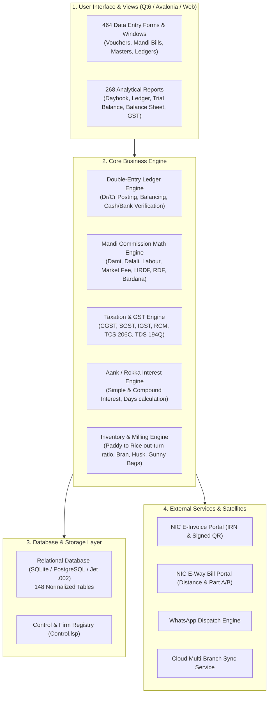

# Bahi-Khata: Complete Master System Specification & Replication Guide

> **Document Version**: 2.0 (Master Engineering Blueprint)  
> **Source Artifact**: `Bahi_Khata.exe` (VB6 Native), Satellite Tools (`EInvoice.exe`, `irn_qr_getter.exe`, `GSTR_Match.exe`, `SyncData.exe`, `Whatsapp.exe`), and Jet Database Schema (`Data.002`, `Data.004`, `Control.lsp`).  
> **Purpose**: Exhaustive architectural specification, database dictionary, UI view catalog, calculation formulas, SQL query repository, and technical roadmap to replicate the entire accounting & ERP suite in modern cross-platform languages (Qt6/C++, Avalonia/.NET 9, or Python/PySide6).

---

## Table of Contents
1. [System Architecture & Domain Overview](#1-system-architecture--domain-overview)
2. [Complete Database Schema & Data Dictionary (All 148 Tables)](#2-complete-database-schema--data-dictionary)
3. [Comprehensive Form & View Specifications (UI, Fields & Events)](#3-comprehensive-form--view-specifications)
4. [Core Business Logic, Formulas & Math Engine](#4-core-business-logic-formulas--math-engine)
5. [Complete SQL Query & Stored Procedure Catalog](#5-complete-sql-query--stored-procedure-catalog)
6. [Satellite Tools & External API Integrations](#6-satellite-tools--external-api-integrations)
7. [Target Modern Implementation Architecture](#7-target-modern-implementation-architecture)

---

## 1. System Architecture & Domain Overview

### 1.1 Domain Context: Indian Mandi, Rice Mill & Industrial Accounting
Bahi-Khata is a specialized **Enterprise Resource Planning (ERP) & Double-Entry Financial Accounting System** built specifically for Indian agricultural mandis (Grain/Cotton/Paddy markets), rice milling factories, commission agents (*Kacha & Pakka Arhatiyas*), and general commercial traders.



### 1.2 Key Domain Concepts
1. **Kacha Arhat (Farmer Commission Agency)**: Receiving paddy/raw grain from farmers (*Zimidars*), issuing *J-Forms*, deducting *Kalam* advances, labour, and market fees, and auctioning to millers/buyers.
2. **Pakka Arhat (Wholesale Trading & Invoicing)**: Purchasing agricultural produce from mandis on commission, issuing *I-Forms* / Tax Invoices, calculating Dami (Commission), Mandi Shulk (Market Fee), HRDF (Haryana Rural Development Fund), and RDF.
3. **Bardana (Gunny Bags / Packaging Management)**: Tracking jute and plastic bags (*Katta / Nag*) along with commodity weight.
4. **Aank / Rokka (Traditional Indian Mandi Interest System)**: Calculating ledger interest on fluctuating daily balances between buyers, commission agents, and lenders.

---

## 2. Complete Database Schema & Data Dictionary

The database contains **148 normalized tables**. Below is the exhaustive schema categorized by subsystem:

### Group 1: Master Tables

#### `CompanyInfo` (Firm Master & Global Settings)
| Column Name | Data Type | Nullable | Description / Business Rule |
| :--- | :--- | :--- | :--- |
| `FirmName` | `VARCHAR(255)` | NOT NULL | Legal registered name of the mill / trading firm |
| `PropName` | `VARCHAR(255)` | NULL | Name of Proprietor / Partners |
| `Address1`, `Address2` | `VARCHAR(255)` | NULL | Registered premises address |
| `District`, `State` | `VARCHAR(255)` | NULL | City and State name |
| `StateCode` | `VARCHAR(2)` | NULL | 2-digit GST state code (`06` = Haryana, `08` = Rajasthan, `03` = Punjab) |
| `PinCode` | `VARCHAR(10)` | NULL | 6-digit postal code (used for distance calculation) |
| `GSTIN` / `TIN` | `VARCHAR(15)` | NULL | 15-digit GSTIN (`06ABKFM5928Q1ZG`) |
| `PANNo` | `VARCHAR(10)` | NULL | 10-digit Income Tax PAN |
| `Phone1`, `Phone2`, `Mobile` | `VARCHAR(50)` | NULL | Contact numbers |
| `BankName`, `AccountNo`, `IFSCCode` | `VARCHAR(100)` | NULL | Primary bank account details for invoice printing |

#### `AccountInfo` (Party / Customer / Supplier / Ledger Master)
| Column Name | Data Type | Nullable | Description / Business Rule |
| :--- | :--- | :--- | :--- |
| `AccountCode` | `INTEGER` | PK | Unique primary key ID for ledger account |
| `AccountName` | `VARCHAR(255)` | NOT NULL | Ledger title (e.g., `M/S Shri Balaji Traders`) |
| `PrintName` | `VARCHAR(255)` | NULL | Formal name printed on bills / cheques |
| `GroupCode` | `INTEGER` | NOT NULL | Group FK (1=Sundry Debtors, 2=Sundry Creditors, 3=Bank, 4=Cash, 5=Expenses, 6=Income) |
| `OpBal` | `DOUBLE` | NULL | Opening balance amount |
| `OpDrCr` | `VARCHAR(2)` | NULL | `Dr` (Debit) or `Cr` (Credit) |
| `GSTIN` | `VARCHAR(15)` | NULL | Party GSTIN (or blank / `URP` for unregistered) |
| `StateCode` | `VARCHAR(2)` | NULL | Party 2-digit GST state code |
| `Address1`, `Address2`, `District`, `PinCode` | `VARCHAR(255)` | NULL | Billing address |
| `Distance` | `DOUBLE` | NULL | Default distance in KM from mill for E-Way Bill |
| `CreditLimit`, `CreditDays` | `DOUBLE`/`INT` | NULL | Credit ceiling and due date duration |
| `InterestRate` | `DOUBLE` | NULL | Annual interest rate % for Aank / Rokka ledger interest |
| `TDSApplicable` | `BOOLEAN` | NULL | 1 if TDS under Sec 194Q / 194H applies |
| `TCSApplicable` | `BOOLEAN` | NULL | 1 if TCS under Sec 206C(1H) applies |

#### `ItemInfo` (Commodities, Finished Goods & Raw Materials)
| Column Name | Data Type | Nullable | Description / Business Rule |
| :--- | :--- | :--- | :--- |
| `ItemCode` | `INTEGER` | PK | Unique Item ID |
| `ItemName` | `VARCHAR(255)` | NOT NULL | Name (e.g. `Basmati Paddy 1121`, `Rice 1509 Steam`, `Rice Bran`, `Husk`) |
| `HSNCode` | `VARCHAR(10)` | NULL | HSN Code (`1006` for Rice, `1209` for Seed, `6305` for Sacks) |
| `TaxRate` | `REAL` | NULL | GST Tax Rate % (`0`, `5`, `12`, `18`) |
| `Unit1st`, `Unit2nd` | `VARCHAR(20)` | NULL | Primary Unit (`QTL`) & Secondary Unit (`BAG`) |
| `ConversionFactor` | `DOUBLE` | NULL | Standard weight per bag (e.g., `0.50` QTL/Bag) |
| `OpStockQty`, `OpStockValue` | `DOUBLE` | NULL | Opening inventory balance |
| `StandardPacking` | `DOUBLE` | NULL | Bag packaging weight (e.g. 25kg, 50kg, 65kg) |
| `IsExempt` | `BOOLEAN` | NULL | 1 if unconditionally tax-free |

---

### Group 2: Core Financial Transactions & Postings

#### `Transactions` (Master Financial & Voucher Ledger Table)
*This is the central financial ledger table representing all double-entry postings.*

| Column Name | Data Type | Description |
| :--- | :--- | :--- |
| `RowNo` | `SMALLINT` | Line sequence within voucher |
| `VoucherNumber` | `INTEGER` | Voucher Sequence ID |
| `VoucherDate` | `DATETIME` | Voucher Date |
| `TransType` | `VARCHAR(5)` | `SL`=Sale, `PR`=Purchase, `CB`=Cash Book, `BK`=Bank, `JV`=Journal, `CN`=Credit Note, `DN`=Debit Note, `BK_ISS`=Mandi Bikri |
| `AccountCode` | `SMALLINT` | Primary Ledger Account FK (`AccountInfo.AccountCode`) |
| `DrCr` | `VARCHAR(3)` | Entry Type: `Dr` or `Cr` |
| `Amount` | `DOUBLE` | Transaction Amount |
| `InvoiceNo` | `VARCHAR(50)` | Commercial / Tax Invoice Number |
| `TaxInvoiceNo` | `VARCHAR(50)` | Formal E-Invoice serial number |
| `PartyCode` | `SMALLINT` | Secondary counter-party FK (for bill-wise tracking) |
| `Narration` | `VARCHAR(200)` | Line description |
| `PlaceOfSupply` | `VARCHAR(2)` | 2-digit POS State Code |
| `ReverseChargePayable` | `INTEGER` | `1` if Reverse Charge (RCM) applies |
| `ITCNotClaim` | `INTEGER` | `1` if Input Tax Credit is Ineligible (Sec 17(5)) |
| `TCSRate`, `TCSTaxable` | `REAL`/`DBL` | TCS 206C(1H) rate and taxable base |
| `TDSRate194Q`, `Taxable194Q` | `REAL`/`DBL` | TDS 194Q rate and taxable base |
| `BankDate`, `VoucherReconcile` | `DATETIME`/`INT` | Bank reconciliation clearance date and flag |
| `EInvStatus`, `EInvAckNo`, `EInvAckDate` | `VARCHAR(255)` | E-Invoice generation status, acknowledgment number & date |
| `ST38No` | `VARCHAR(255)` | E-Way Bill Number |
| `EWayStatus` | `VARCHAR(50)` | `Live`, `Cancelled`, `Expired` |

---

### Group 3: Mandi & Agricultural Trading Transactions

#### `BikriIssueVouchers` (Farmer Mandi Sale & Auction Vouchers)
| Column Name | Data Type | Description |
| :--- | :--- | :--- |
| `VoucherDate` | `DATETIME` | Auction / Sale Date |
| `VoucherNumber` | `INTEGER` | Bikri Voucher ID |
| `RowNo` | `INTEGER` | Line item serial |
| `InvoiceNo` | `VARCHAR(255)` | Bikri Parchha / Auction Slip No |
| `AccountCode` | `INTEGER` | Buyer Mill / Trader FK |
| `ItemCode` | `INTEGER` | Commodity FK (Paddy / Cotton / Mustard) |
| `Bags` | `DOUBLE` | Number of Bags / Kattas |
| `Packing` | `DOUBLE` | Packing Tare Weight |
| `Weight` | `DOUBLE` | Net Weight in Quintals |
| `Rate` | `DOUBLE` | Rate per Quintal |
| `Amount` | `DOUBLE` | Basic Value = `Weight * Rate` |
| `TaxRate` | `REAL` | GST / Mandi Tax Rate |
| `DamiRate`, `DamiAmt` | `DOUBLE` | Commission Agent Rate % & Amount |
| `MarketFeeRate`, `MarketFeeAmt` | `DOUBLE` | Mandi Shulk Rate % & Amount |
| `HRDFRate`, `HRDFAmt` | `DOUBLE` | Rural Development Fund % & Amount |
| `LabourAmt`, `UtraiAmt`, `ChhanniAmt`| `DOUBLE` | Palledari (handling), Unloading, and Sieving expenses |
| `ZimidarName` | `VARCHAR(255)` | Farmer Name / Source of Grain |

#### `BardanaTransactions` (Gunny Bag Inventory & Party Ledger)
| Column Name | Data Type | Description |
| :--- | :--- | :--- |
| `VoucherDate` | `DATETIME` | Transaction Date |
| `VoucherNumber` | `DOUBLE` | Voucher ID |
| `VchType` | `VARCHAR(255)` | `Issue`, `Receive`, `Sale`, `Purchase` |
| `AccountCode` | `INTEGER` | Party FK |
| `BardanaType` | `VARCHAR(50)` | `Jute New`, `Jute Old`, `Plastic 50kg`, `Plastic 25kg` |
| `Qty` | `VARCHAR(255)` | Number of Bags |
| `Rate` | `DOUBLE` | Rate per bag |
| `VehNo` | `VARCHAR(255)` | Truck / Tractor Trolley Vehicle No |
| `Narration` | `VARCHAR(255)` | Remarks |

---

### Group 4: System Configuration & Fiscal Settings

#### `VoucherSettings` (Global Engine Rules & Switches)
*Controls all calculation switches, rounding rules, tax behavior, and API keys.*

| Setting Name | Data Type | Business Meaning |
| :--- | :--- | :--- |
| `VoucherType` | `VARCHAR(6)` | Target voucher (`SL`, `PR`, `CB`, `BK`, `JV`) |
| `FirstTotalRoundOff` | `BOOLEAN` | Round basic line amount to nearest rupee |
| `DamiRoundOff` | `BOOLEAN` | Round Commission (Dami) |
| `MarketFeeRoundOff` | `BOOLEAN` | Round Mandi Market Fee |
| `HRDFRoundOff` | `BOOLEAN` | Round Haryana Rural Development Fund |
| `LabourRoundOff` | `BOOLEAN` | Round Handling / Labour charges |
| `Roundoff` | `BOOLEAN` | Final invoice total rounding switch |
| `TaxIncludeInFirstAmount` | `BOOLEAN` | Inclusive vs Exclusive GST calculation |
| `Welfare`, `Gaushala`, `Dharmada` | `DOUBLE` | Charitable cess deduction percentages |
| `ApplyTCS`, `TCSRateNormal` | `INT`/`DBL` | TCS 206C(1H) active flag and default rate (0.1%) |
| `ApplyTDS194Q`, `TDSRate194Q` | `INT`/`DBL` | TDS 194Q active flag and default rate (0.1%) |
| `AutoEInvoice` | `INTEGER` | Auto-launch E-Invoice generation on voucher save |
| `AutoOnlyEWayBill` | `INTEGER` | Auto-launch E-Way Bill generation on voucher save |
| `EInvoiceFilePath` | `VARCHAR(255)` | Local JSON export folder path |
| `GSTNUserName`, `GSTNPasswd` | `VARCHAR(255)` | GST Portal API login credentials |
| `EWBUserName`, `EWBPasswd` | `VARCHAR(255)` | E-Way Bill Portal API login credentials |
| `YourID` | `VARCHAR(255)` | Gateway Account Subscription Identifier |

---

## 3. Comprehensive Form & View Specifications

### 3.1 Voucher Entry Form (`frmBikriVoucher` / `frmSaleVoucher`)
- **Purpose**: Primary billing window for selling milled rice, grain, and mandi commodities.
- **Keyboard Navigation Conventions**:
  - `Enter`: Move focus to next logical field.
  - `Tab`: Jump sections.
  - `F1`: Toggle E-Invoice / IRN Details Pane.
  - `F2`: Change Voucher Date.
  - `F3`: Create New Party Master popup.
  - `F4`: Create New Item Master popup.
  - `F7`: Bill Sundry / Expense Allocations.
  - `F8`: Mandi Expense Breakdown (Dami, M.Fee, HRDF).
  - `F12`: Save Voucher & Print Bill.

```
+-----------------------------------------------------------------------------------------+
| SALE INVOICE ENTRY                                             [Series: MAIN] [No: 142] |
+-----------------------------------------------------------------------------------------+
| Date: [21/09/2026]  Type: [Tax Invoice (B2B)]  POS: [08-Rajasthan]  RevCharge: [No]     |
| Party: [M/S SHRI BALAJI AGRO TRADERS      ]  GSTIN: [08AAECB2345M1Z2]  Bal: 4,50,000 Dr  |
| Broker: [SURESH KUMAR DALAL              ]  VehNo: [HR-57-A-1234]     Station: [H.Garh] |
+-----------------------------------------------------------------------------------------+
| Line Items Grid:                                                                        |
| Sr | Item Name                 | HSN      | Bags | Weight (Qtl) | Rate   | Tax% | Amount   |
|----+---------------------------+----------+------+--------------+--------+------+----------|
| 1  | Basmati Rice 1121 Steam   | 10063020 |  200 |       100.00 | 6500.0 | 5.0% | 6,50,000 |
| 2  | Rice Bran                 | 23069090 |  100 |        50.00 | 2800.0 | 5.0% | 1,40,000 |
+-----------------------------------------------------------------------------------------+
| Tax & Sundry Breakdown:                                  | Invoice Summary:             |
| Basic Goods Amount:                        7,90,000.00   | Total Bags:          300     |
| Dami / Commission (2.00%):                   15,800.00   | Total Weight:     150.00 Qtl |
| Mandi Market Fee (2.00%):                    15,800.00   | IGST Amount:       39,500.00 |
| HRDF (2.00%):                                15,800.00   | TCS 206C (0.1%):      876.60 |
| Palledari / Labour:                           1,200.00   | Round Off:              0.40 |
| Bardana Amount (300 Bags @ 45):              13,500.00   | NET BILL AMOUNT: 8,77,000.00 |
+-----------------------------------------------------------------------------------------+
| [F12 - Save & Print]   [F1 - Generate E-Invoice]   [F9 - E-Way Bill]   [Esc - Cancel]   |
+-----------------------------------------------------------------------------------------+
```

### 3.2 Account Ledger View (`frmLedger`)
- **Purpose**: Displays full historical running ledger of any account with date criteria, running balance, running interest, and voucher drill-down.
- **Columns**: `Date`, `Vch No`, `Vch Type`, `Particulars / Narration`, `Debit Amount`, `Credit Amount`, `Dr/Cr`, `Running Balance`, `Days`, `Aank (Interest Product)`.
- **Drill-down Action**: Double-clicking or pressing `Enter` on any row opens the underlying transaction in its native editing form.

### 3.3 Day Book View (`frmDayBook`)
- **Purpose**: Chronological audit register of all daily vouchers across cash, bank, journal, sale, purchase, and mandi entries.
- **Filtering**: By Date range, Voucher Type (`All`, `Only Cash`, `Only Sale`, `Only Purchase`, `Only Bank`), and User ID.

---

## 4. Core Business Logic, Formulas & Math Engine

### 4.1 Mandi Billing & Expense Math
For a given Mandi / Mill Purchase or Sale:

$$\text{Gross Weight} = \text{Bags} \times \text{Packing Factor}$$
$$\text{Net Weight} = \text{Gross Weight} - \text{Tare Weight} - \text{Moisture Deduction}$$
$$\text{Basic Goods Value} = \text{Net Weight (in Qtl)} \times \text{Rate per Qtl}$$

$$\text{Dami (Commission)} = \text{Basic Goods Value} \times \left(\frac{\text{DamiRate}}{100}\right)$$
$$\text{Market Fee (Mandi Shulk)} = \text{Basic Goods Value} \times \left(\frac{\text{MarketFeeRate}}{100}\right)$$
$$\text{HRDF (Haryana Rural Dev Fund)} = \text{Basic Goods Value} \times \left(\frac{\text{HRDFRate}}{100}\right)$$
$$\text{Labour (Palledari)} = \text{Bags} \times \text{LabourRatePerBag}$$
$$\text{Bardana (Bag Value)} = \text{Bags} \times \text{RatePerBag}$$

$$\text{Taxable Amount} = \text{Basic Goods Value} + \text{Dami} + \text{Labour} + \text{Bardana} + \text{OtherTaxableExpenses}$$

### 4.2 GST Tax Calculation & State POS Splitting

$$\text{IsIntraState} = (\text{PartyStateCode} == \text{CompanyStateCode}) \lor (\text{PlaceOfSupply} == \text{CompanyStateCode})$$

- If **Intra-State**:
  $$\text{CGST} = \text{Round}\left(\text{Taxable Amount} \times \frac{\text{TaxRate}}{2 \times 100}, 2\right)$$
  $$\text{SGST} = \text{Round}\left(\text{Taxable Amount} \times \frac{\text{TaxRate}}{2 \times 100}, 2\right)$$
  $$\text{IGST} = 0.00$$
- If **Inter-State**:
  $$\text{CGST} = 0.00, \quad \text{SGST} = 0.00$$
  $$\text{IGST} = \text{Round}\left(\text{Taxable Amount} \times \frac{\text{TaxRate}}{100}, 2\right)$$

### 4.3 TCS 206C(1H) & TDS 194Q Calculation
- **TCS 206C(1H)**: Applies on receipt/sale when total annual turnover from buyer exceeds ₹50,00,000.
  $$\text{TCS Taxable} = \max(0, \text{Cumulative Receipts} - 5000000)$$
  $$\text{TCS Amount} = \text{TCS Taxable} \times 0.001 \quad (0.1\%)$$
- **TDS 194Q**: Applies on purchase value exceeding ₹50,00,000:
  $$\text{TDS 194Q Amount} = \text{Taxable Base} \times 0.001 \quad (0.1\%)$$

### 4.4 Aank / Rokka Traditional Interest Math
In Indian agricultural markets, interest is calculated using daily **Products (Aank)**:

$$\text{Days} = \text{Current Transaction Date} - \text{Previous Transaction Date}$$
$$\text{Aank (Product)} = \text{Running Balance} \times \text{Days}$$
$$\text{Total Interest} = \frac{\sum \text{Aank} \times \text{Annual Interest Rate}}{36500}$$

---

## 5. Complete SQL Query & Stored Procedure Catalog

Below are key SQL query templates extracted from `Bahi_Khata.exe`:

### 5.1 Ledger Extraction Query
```sql
SELECT 
    VoucherDate, 
    VoucherNumber, 
    TransType, 
    InvoiceNo, 
    Narration, 
    IIF(DrCr='Dr', Amount, 0) AS DebitAmount, 
    IIF(DrCr='Cr', Amount, 0) AS CreditAmount 
FROM Transactions 
WHERE AccountCode = ? 
  AND VoucherDate BETWEEN ? AND ? 
ORDER BY VoucherDate ASC, VoucherNumber ASC;
```

### 5.2 Day Book Query
```sql
SELECT 
    T.VoucherDate, 
    T.VoucherNumber, 
    T.TransType, 
    A.AccountName, 
    T.InvoiceNo, 
    T.Narration, 
    IIF(T.DrCr='Dr', T.Amount, 0) AS Debit, 
    IIF(T.DrCr='Cr', T.Amount, 0) AS Credit 
FROM Transactions T 
INNER JOIN AccountInfo A ON T.AccountCode = A.AccountCode 
WHERE T.VoucherDate BETWEEN ? AND ? 
ORDER BY T.VoucherDate ASC, T.VoucherNumber ASC;
```

### 5.3 Trial Balance Query
```sql
SELECT 
    A.AccountCode, 
    A.AccountName, 
    A.GroupCode, 
    G.GroupName, 
    SUM(IIF(T.DrCr='Dr', T.Amount, 0)) AS TotalDr, 
    SUM(IIF(T.DrCr='Cr', T.Amount, 0)) AS TotalCr, 
    (A.OpBal + SUM(IIF(T.DrCr='Dr', T.Amount, -T.Amount))) AS ClosingBal 
FROM (AccountInfo A 
LEFT JOIN Transactions T ON A.AccountCode = T.AccountCode) 
INNER JOIN GroupMaster G ON A.GroupCode = G.GroupCode 
GROUP BY A.AccountCode, A.AccountName, A.GroupCode, G.GroupName, A.OpBal;
```

### 5.4 GSTR-1 B2B Query
```sql
SELECT 
    A.GSTIN AS ReceiverGSTIN, 
    A.AccountName AS ReceiverName, 
    T.InvoiceNo, 
    T.VoucherDate AS InvoiceDate, 
    T.Amount AS InvoiceValue, 
    T.PlaceOfSupply AS POS, 
    IIF(T.ReverseChargePayable=1, 'Y', 'N') AS ReverseCharge, 
    'Regular' AS InvoiceType, 
    B.TaxRate, 
    SUM(B.Amount) AS TaxableValue, 
    SUM(IIF(T.PlaceOfSupply <> C.StateCode, B.Amount * B.TaxRate / 100, 0)) AS IGST, 
    SUM(IIF(T.PlaceOfSupply = C.StateCode, B.Amount * (B.TaxRate / 2) / 100, 0)) AS CGST, 
    SUM(IIF(T.PlaceOfSupply = C.StateCode, B.Amount * (B.TaxRate / 2) / 100, 0)) AS SGST 
FROM (((Transactions T 
INNER JOIN AccountInfo A ON T.AccountCode = A.AccountCode) 
INNER JOIN BikriIssueVouchers B ON T.VoucherNumber = B.VoucherNumber) 
CROSS JOIN CompanyInfo C) 
WHERE T.TransType = 'SL' 
  AND LEN(A.GSTIN) = 15 
  AND T.VoucherDate BETWEEN ? AND ? 
GROUP BY A.GSTIN, A.AccountName, T.InvoiceNo, T.VoucherDate, T.Amount, T.PlaceOfSupply, T.ReverseChargePayable, B.TaxRate, C.StateCode;
```

---

## 6. Satellite Tools & External API Integrations

### 6.1 E-Invoice & Signed QR Subsystem (`irn_qr_getter.exe`)
- **Protocol**: Direct HTTPS REST with TLS 1.2.
- **Workflow**:
  1. Serializes `TempEWayTableByIRN` into JSON Schema v1.1.
  2. Posts payload to Gateway / NIC API (`/eivital/v1.03/Invoice`).
  3. Decodes returned `SignedQRCode` JWT string using `ZXing.BarcodeWriter` (Format: `QR_CODE`, Correction Level: `M`).
  4. Saves rendered QR graphic to `IRN.jpg` and writes `EInvAckNo` & `EInvStatus='Generated'` to database.

### 6.2 WhatsApp Dispatch Subsystem (`Whatsapp.exe`)
- **Workflow**:
  1. Renders sales invoice to high-resolution PDF (`STC TO SHRI BALAJI.PDF` via iTextSharp/PDF printing).
  2. Reads party mobile number from `AccountInfo.Mobile`.
  3. Formats template: *"Dear Customer, please find attached Invoice #INV-142 for Rs. 8,77,000 from M/S Mahadev Rice Industry."*
  4. Automates dispatch via WhatsApp Business Web API / Selenium WebDriver.

### 6.3 Data Sync & Backup Subsystem (`SyncData.exe`)
- **Workflow**:
  1. Compresses `Data.002` Jet database using `SharpCompress` (`Bahi_Khata <date>.rar`).
  2. Syncs delta records across local LAN branches using TCP sockets / HTTP endpoint.
  3. Uploads encrypted backup to off-site cloud storage.

---

## 7. Target Modern Implementation Architecture

### 7.1 Recommended Tech Stack: Qt 6 with C++ (or C# with Avalonia)

```
bahi-khata-modern/
├── CMakeLists.txt
├── src/
│   ├── main.cpp
│   ├── core/
│   │   ├── DatabaseManager.cpp       (SQLite / PostgreSQL OLEDB abstraction)
│   │   ├── AccountingEngine.cpp      (Double-entry ledger posting rules)
│   │   ├── MandiCalculator.cpp       (Dami, Market Fee, HRDF, Labour math)
│   │   ├── TaxEngine.cpp             (GST, TCS 206C, TDS 194Q)
│   │   └── AankInterestEngine.cpp    (Traditional Mandi interest product system)
│   │
│   ├── models/
│   │   ├── AccountModel.hpp          (Party / Customer DTO)
│   │   ├── VoucherModel.hpp          (Transaction & Line Item DTOs)
│   │   ├── ItemModel.hpp             (Commodity DTO)
│   │   └── Gstr1Models.hpp           (B2B, B2CL, B2CS, HSN DTOs)
│   │
│   ├── views/
│   │   ├── MainWindow.ui / .cpp      (MDI Application shell & menus)
│   │   ├── VoucherEntryDialog.ui/.cpp(Sale / Purchase / Mandi billing grid)
│   │   ├── CashBookDialog.ui / .cpp  (Cash payment / receipt window)
│   │   ├── LedgerView.ui / .cpp      (Interactive drill-down ledger)
│   │   ├── DayBookView.ui / .cpp     (Daily audit book)
│   │   └── GstReportsDialog.ui / .cpp(GSTR-1, GSTR-2A, GSTR-3B generator)
│   │
│   ├── services/
│   │   ├── EInvoiceClient.cpp        (Direct NIC API client & JWT decoder)
│   │   ├── QrCodeGenerator.cpp       (ZXing / libqrencode integration)
│   │   ├── PdfReportGenerator.cpp    (QPainter / Poppler invoice PDF generator)
│   │   └── WhatsAppService.cpp       (Cloud API invoice dispatcher)
│   │
│   └── database/
│       └── schema.sqlite.sql         (Clean modern relational schema)
```

---
*Authored as the complete reference manual for recreating the Bahi-Khata accounting software on Linux, macOS, and Windows.*
