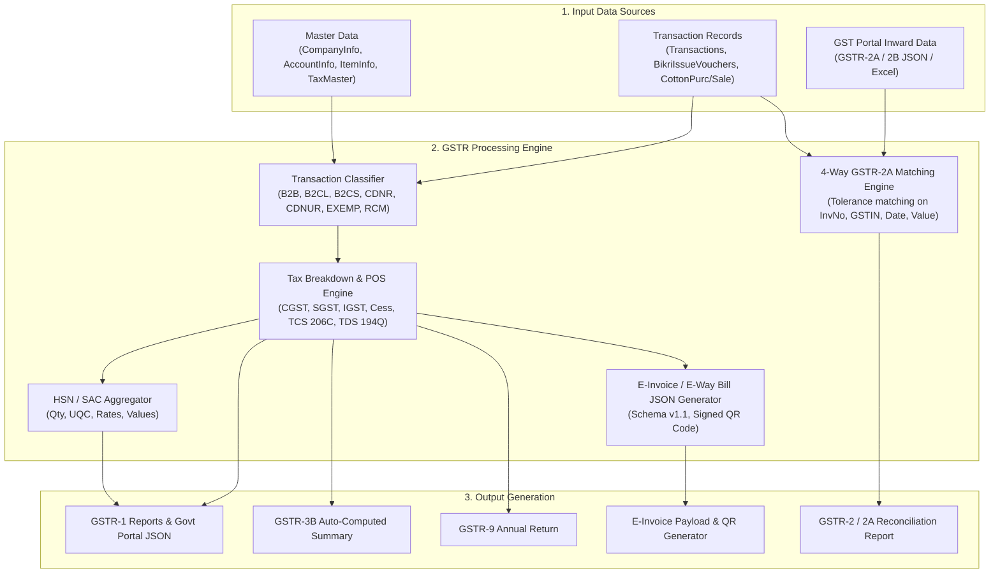
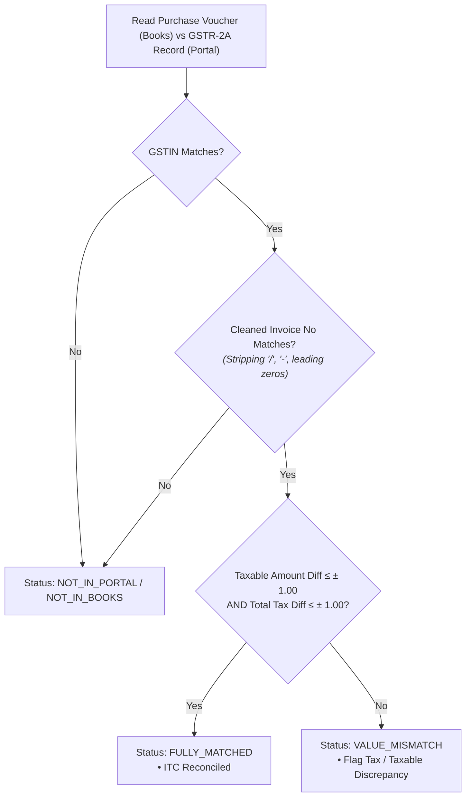

# GSTR Engine: Architecture, Data Models, Logic & Replication Guide

> **Target Audience**: AI Agents, Systems Architects, and Software Engineers.  
> **Purpose**: Complete blueprint to replicate the entire GST / GSTR Engine (GSTR-1, GSTR-2 / 2A / 2B Reconciliation, GSTR-3B, GSTR-4, GSTR-9, and E-Invoice / E-Way Bill generation) cleanly in modern cross-platform languages (C++ / Qt, C# / .NET, or Python).

---

## 1. Executive Summary & Engine Overview

The **GSTR Engine** is the tax intelligence subsystem of Bahi-Khata. It aggregates, validates, reconciles, and exports Goods and Services Tax (GST) data for Indian commercial enterprises (specifically optimized for agricultural trading, mandi commission, paddy/rice milling, and general manufacturing).



---

## 2. Database Schema & Field Mapping

### A. Core Tables & Relevant Fields

#### 1. `CompanyInfo` (The Taxpayer Firm)
| Field Name | Type | Description |
| :--- | :--- | :--- |
| `FirmName` | `VARCHAR(255)` | Legal trade name of the entity |
| `GSTIN` / `TIN` | `VARCHAR(15)` | 15-character GST Identification Number (e.g. `06ABKFM5928Q1ZG`) |
| `State` | `VARCHAR(255)` | Home State (e.g. `Haryana`) |
| `StateCode` | `VARCHAR(2)` | 2-digit GST State Code (`06` for Haryana, `08` for Rajasthan, `03` for Punjab, etc.) |
| `PANNo` | `VARCHAR(10)` | 10-character Permanent Account Number |
| `Address1`, `Address2`, `District`, `PinCode` | `VARCHAR` | Registered Principal Place of Business |

#### 2. `AccountInfo` (Customer / Supplier / Party Master)
| Field Name | Type | Description |
| :--- | :--- | :--- |
| `AccountCode` | `INTEGER (PK)` | Unique integer party identifier |
| `AccountName` | `VARCHAR(255)` | Trade/Legal Name of Party |
| `GSTIN` / `TIN` | `VARCHAR(15)` | Party GSTIN (15 chars, or blank/`URP` if Unregistered) |
| `State` | `VARCHAR(255)` | Party State |
| `StateCode` | `VARCHAR(2)` | 2-digit State code (determines Intra-State vs Inter-State) |
| `PANNo` | `VARCHAR(10)` | PAN of party |
| `PartyType` | `VARCHAR(50)` | `Registered`, `Unregistered`, `Composition`, `Consumer`, `SEZ`, `Export` |
| `IsComposition` | `INTEGER/BOOLEAN` | `1` if party is under Composition Scheme |
| `Distance` | `DOUBLE` | Distance in KM (for E-Way Bill calculation) |

#### 3. `ItemInfo` (Goods & Commodity Master)
| Field Name | Type | Description |
| :--- | :--- | :--- |
| `ItemCode` | `INTEGER (PK)` | Unique item identifier |
| `ItemName` | `VARCHAR(255)` | Commodity Description (e.g. `Paddy PR-106`, `Rice 1121`, `Rice Bran`, `Bardana`) |
| `HSNCode` | `VARCHAR(10)` | HSN / SAC Code (e.g. `1006` for Rice, `1209` for Seeds, `6305` for Sacks) |
| `UQC` / `Unit` | `VARCHAR(20)` | Unit Quantity Code (`QTL` - Quintal, `BAG` - Bags, `KGS` - Kilograms, `NOS` - Numbers) |
| `TaxRate` | `REAL/DOUBLE` | Default GST Rate (0%, 5%, 12%, 18%, 28%) |
| `IsExempt` | `INTEGER/BOOLEAN` | `1` if item is unconditionally exempt / Nil rated |
| `CessRate` | `REAL/DOUBLE` | Cess percentage if applicable |

#### 4. `Transactions` (Header & Master Posting)
| Field Name | Type | Description |
| :--- | :--- | :--- |
| `VoucherNumber` | `INTEGER` | Internal voucher sequence number |
| `VoucherDate` | `DATETIME` | Transaction / Invoice Date |
| `TransType` | `VARCHAR(5)` | `SL` (Sale), `PR` (Purchase), `CN` (Credit Note), `DN` (Debit Note), `CB` (Cash), `BK` (Bank) |
| `InvoiceNo` | `VARCHAR(50)` | Tax Invoice Number issued to/by party |
| `TaxInvoiceNo` | `VARCHAR(50)` | Formal alphanumeric tax invoice number |
| `AccountCode` | `INTEGER` | Counter-party account code |
| `Amount` | `DOUBLE` | Total Invoice Value (including taxes and sundry charges) |
| `PlaceOfSupply` | `VARCHAR(2)` | 2-digit POS State Code (defaults to Buyer's State Code) |
| `ReverseChargePayable` | `INTEGER` | `1` if transaction is subject to Reverse Charge (RCM Sec 9(3)/9(4)) |
| `ITCNotClaim` | `INTEGER` | `1` if Input Tax Credit is Ineligible (Sec 17(5)) |
| `CompositionVch` | `INTEGER` | `1` if bill is under composition rules |
| `ECommGSTIN` | `VARCHAR(15)` | GSTIN of E-Commerce Operator (if supply via e-commerce) |
| `TCSRate`, `TCSTaxable` | `REAL/DOUBLE` | Tax Collected at Source under Sec 206C(1H) |
| `TDSRate194Q`, `Taxable194Q` | `REAL/DOUBLE` | TDS under Sec 194Q |

#### 5. Line Item Vouchers (`BikriIssueVouchers`, `CottonPurcVoucher`, `SaleVoucherDetail`)
| Field Name | Type | Description |
| :--- | :--- | :--- |
| `VoucherNumber` | `INTEGER` | Foreign key to `Transactions.VoucherNumber` |
| `RowNo` | `INTEGER` | Line item serial number |
| `ItemCode` | `INTEGER` | FK to `ItemInfo.ItemCode` |
| `Bags`, `Packing`, `Weight` | `DOUBLE` | Quantity metrics |
| `Rate` | `DOUBLE` | Unit rate per Quintal / Bag / KG |
| `TaxRate` | `REAL` | GST Tax Rate applied (0, 5, 12, 18, 28) |
| `Amount` | `DOUBLE` | Line Item Taxable Value = `Weight * Rate` (or `Qty * Rate` + extra taxable expenses) |

---

## 3. GST Calculation & Classification Rules

### A. Intra-State vs Inter-State Determination
```c
bool isIntraState = (PartyStateCode == CompanyStateCode) || (PlaceOfSupply == CompanyStateCode);

if (isIntraState) {
    // Split GST equally between Central and State
    CGST_Rate = TaxRate / 2.0;
    SGST_Rate = TaxRate / 2.0;
    IGST_Rate = 0.0;
    
    CGST_Amount = Round(TaxableValue * (CGST_Rate / 100.0), 2);
    SGST_Amount = Round(TaxableValue * (SGST_Rate / 100.0), 2);
    IGST_Amount = 0.0;
} else {
    // Full GST goes to Integrated GST
    CGST_Rate = 0.0;
    SGST_Rate = 0.0;
    IGST_Rate = TaxRate;
    
    CGST_Amount = 0.0;
    SGST_Amount = 0.0;
    IGST_Amount = Round(TaxableValue * (IGST_Rate / 100.0), 2);
}
TotalTax = CGST_Amount + SGST_Amount + IGST_Amount + Cess_Amount;
InvoiceTotal = TaxableValue + TotalTax + OtherCharges + RoundOff;
```

---

## 4. GSTR-1 Specification & Section Logic

GSTR-1 aggregates all **Outward Supplies** (Sales, Credit/Debit Notes, Advances). The engine filters `Transactions` where `TransType IN ('SL', 'CN', 'DN')` within the given return period `[StartDate, EndDate]`.

### Summary of Tables Generated:

| Table No | Name in Portal | Condition / Filter | Key Fields Exported |
| :--- | :--- | :--- | :--- |
| **4A, 4B, 4C, 6B, 6C** | **B2B Invoices** | Counter-party has valid 15-char GSTIN (`Len(GSTIN) == 15`) | `GSTIN`, `Receiver Name`, `Invoice No`, `Invoice Date`, `Invoice Value`, `Place of Supply`, `Reverse Charge (Y/N)`, `Applicable % of Tax Rate`, `Invoice Type (Regular/SEZ/Deemed)`, `E-Commerce GSTIN`, `Taxable Value`, `Cess Amount` |
| **5A, 5B** | **B2CL (Large Invoices)** | Unregistered party (`Len(GSTIN) != 15`), **Inter-State** (`POS != HomeState`), and `Invoice Value > 250,000` | `Invoice No`, `Invoice Date`, `Invoice Value`, `Place of Supply`, `Applicable %`, `Taxable Value`, `Cess Amount`, `E-Commerce GSTIN` |
| **7** | **B2CS (Small Invoices)** | Unregistered party (`Len(GSTIN) != 15`) AND NOT B2CL (i.e. all Intra-State unregistered + Inter-State $\le$ 2.5 Lakhs) | **Aggregated by [Type, Place of Supply, Tax Rate]**:<br>`Type (OE/E)`, `Place of Supply`, `Applicable %`, `Rate`, `Taxable Value`, `Cess Amount`, `E-Commerce GSTIN` |
| **8A, 8B, 8C, 8D** | **Nil Rated, Exempt & Non-GST** | Line items where `TaxRate == 0` or `IsExempt == 1` | `Description (Nil Rated / Exempted / Non-GST)`, `Inter-State to Reg`, `Intra-State to Reg`, `Inter-State to Unreg`, `Intra-State to Unreg` |
| **9B** | **CDNR (Credit / Debit Notes Reg)** | `TransType IN ('CN', 'DN')` and `Len(PartyGSTIN) == 15` | `GSTIN`, `Receiver Name`, `Note/Refund Voucher No`, `Note Date`, `Note Type (C/D)`, `Place of Supply`, `Reverse Charge`, `Note Supply Type`, `Note Value`, `Applicable %`, `Rate`, `Taxable Value`, `Cess` |
| **9B** | **CDNUR (Credit / Debit Notes Unreg)** | `TransType IN ('CN', 'DN')` and `Len(PartyGSTIN) != 15` (for B2CL/Export) | `UR Type (B2CL/EXPWP/EXPWOP)`, `Note No`, `Note Date`, `Note Type`, `Place of Supply`, `Note Value`, `Applicable %`, `Rate`, `Taxable Value`, `Cess` |
| **12** | **HSN-wise Summary of Outward Supplies** | All outward supplies aggregated by HSN | `HSN`, `Description`, `UQC`, `Total Quantity`, `Total Value`, `Taxable Value`, `Integrated Tax Amount`, `Central Tax Amount`, `State/UT Tax Amount`, `Cess Amount` |
| **13** | **Documents Issued During Period** | Number sequences from `Transactions` | `Nature of Document (Invoices, Debit Notes, Credit Notes)`, `Sr. No From`, `Sr. No To`, `Total Number`, `Cancelled`, `Net Issued` |

---

## 5. GSTR-2 / 2A / 2B Reconciliation Engine

The GSTR-2 matching engine reconciles purchase vouchers booked in the accounting ledger against data downloaded from the GST Portal (supplier-filed invoices).

### 4-Way Matching Algorithm


### Reconciliation Match Categories:
1. **Fully Matched (`MATCHED`)**:
   - `PartyGSTIN == PortalGSTIN`
   - `CleanInvoiceNo(BookInvNo) == CleanInvoiceNo(PortalInvNo)`
   - `|BookTaxable - PortalTaxable| <= 1.00`
   - `|BookTax - PortalTax| <= 1.00`
2. **Value Mismatched (`MISMATCH`)**:
   - GSTIN and Invoice Number match, but taxable amount or tax values differ beyond the rounding threshold.
3. **In Portal, Not in Books (`NOT_IN_BOOKS`)**:
   - Supplier uploaded the invoice in their GSTR-1, but the mill accountant has not entered the purchase bill in Bahi-Khata (eligible unclaimed ITC!).
4. **In Books, Not in Portal (`NOT_IN_PORTAL`)**:
   - Bahi-Khata has booked the purchase and claimed ITC, but the supplier has **defaulted / not filed** GSTR-1 (risk of ITC reversal under Rule 37A).

---

## 6. GSTR-3B Auto-Computation Engine

GSTR-3B is the monthly self-declaration summary used to discharge tax liability.

### Computation Logic:

```python
# 3.1 Details of Outward Supplies and Inward Supplies Liable to Reverse Charge
Table_3_1_a_TaxableOutward = Sum(Sales.TaxableValue where TaxRate > 0 and RCM == False)
Table_3_1_a_IGST = Sum(Sales.IGST where TaxRate > 0 and RCM == False)
Table_3_1_a_CGST = Sum(Sales.CGST where TaxRate > 0 and RCM == False)
Table_3_1_a_SGST = Sum(Sales.SGST where TaxRate > 0 and RCM == False)

Table_3_1_b_ZeroRatedOutward = Sum(Sales.TaxableValue where SupplyType == 'EXPORT' or SupplyType == 'SEZ')
Table_3_1_c_OtherExemptNil = Sum(Sales.TaxableValue where TaxRate == 0 or IsExempt == True)

# Inward supplies subject to reverse charge (RCM)
Table_3_1_d_InwardRCM_Taxable = Sum(Purchases.TaxableValue where RCM == True)
Table_3_1_d_InwardRCM_Tax = Sum(Purchases.Tax where RCM == True)

# 4. Eligible Input Tax Credit (ITC)
Table_4_A_3_InwardRCM_ITC = Table_3_1_d_InwardRCM_Tax # ITC available on RCM
Table_4_A_5_AllOtherITC_IGST = Sum(Purchases.IGST where RCM == False and ITCNotClaim == False)
Table_4_A_5_AllOtherITC_CGST = Sum(Purchases.CGST where RCM == False and ITCNotClaim == False)
Table_4_A_5_AllOtherITC_SGST = Sum(Purchases.SGST where RCM == False and ITCNotClaim == False)

# Ineligible ITC (Section 17(5) Blocked Credit)
Table_4_D_1_BlockedITC = Sum(Purchases.Tax where ITCNotClaim == True)
```

---

## 7. E-Invoice & Signed QR Engine

The E-Invoice subsystem generates standardized JSON compliant with the **NIC E-Invoice Standard Schema (INV-01 / v1.1)**.

### E-Invoice Payload Structure (JSON Example):
```json
{
  "Version": "1.1",
  "TranDtls": {
    "TaxSch": "GST",
    "SupTyp": "B2B",
    "RegRev": "N",
    "EcmGstin": null,
    "IgstOnIntra": "N"
  },
  "DocDtls": {
    "Typ": "INV",
    "No": "MRE/2026/0142",
    "Dt": "21/09/2026"
  },
  "SellerDtls": {
    "Gstin": "06ABKFM5928Q1ZG",
    "LglNm": "MAHADEV RICE INDUSTRY",
    "TrdNm": "MAHADEV RICE INDUSTRY",
    "Addr1": "Mandi Dabwali Road",
    "Loc": "Sirsa",
    "Pin": 125055,
    "Stcd": "06"
  },
  "BuyerDtls": {
    "Gstin": "08AAECB2345M1Z2",
    "LglNm": "SHRI BALAJI AGRO TRADERS",
    "TrdNm": "SHRI BALAJI AGRO",
    "Pos": "08",
    "Addr1": "Anaj Mandi",
    "Loc": "Hanumangarh",
    "Pin": 335512,
    "Stcd": "08"
  },
  "ItemList": [
    {
      "SlNo": "1",
      "PrdDesc": "Basmati Rice 1121 Steam",
      "IsServc": "N",
      "HsnCd": "10063020",
      "Qty": 200.0,
      "Unit": "QTL",
      "UnitPrice": 6500.0,
      "TotAmt": 1300000.0,
      "Discount": 0.0,
      "PreTaxVal": 1300000.0,
      "AssAmt": 1300000.0,
      "GstRt": 5.0,
      "IgstAmt": 65000.0,
      "CgstAmt": 0.0,
      "SgstAmt": 0.0,
      "CesRt": 0.0,
      "CesAmt": 0.0,
      "TotItemVal": 1365000.0
    }
  ],
  "ValDtls": {
    "AssVal": 1300000.0,
    "CgstVal": 0.0,
    "SgstVal": 0.0,
    "IgstVal": 65000.0,
    "CesVal": 0.0,
    "RndOffAmt": 0.0,
    "TotInvVal": 1365000.0
  }
}
```

---

## 8. Target Cross-Platform Implementation Guide

When implementing this engine in **Qt / C++**, **C# / Avalonia**, or **Python**:

### Architecture Components to Build:
1. `GstTaxEngine`: Handles tax splitting, rounding, intra/inter state checking, and TCS/TDS computation.
2. `Gstr1Builder`: Reads database transactions and groups data into B2B, B2CL, B2CS, CDNR, HSN tables.
3. `Gstr2Reconciler`: Implements the 4-way matching algorithm with string normalization and floating point tolerance ($\pm 1.00$).
4. `Gstr3BComputer`: Aggregates monthly totals for Table 3.1 and Table 4.
5. `EInvoiceClient`: Serializes vouchers into INV-01 JSON payloads and parses returned IRN & QR responses.
6. `GstrExcelExporter`: Outputs standard government Excel workbooks (`GSTR-1.xls`, `GSTR-2.xls`, `GSTR-3B.xls`) matching official GST offline utility formats.

---
*Generated from decompiled source analysis of `Bahi_Khata.exe`, `GSTR_Match.exe`, `MatchGSTR2.exe`, `EInvoice.exe`, and database schema `Data.002`.*
