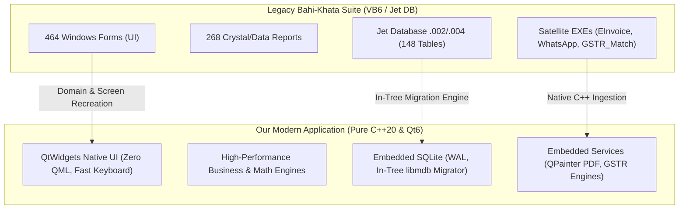
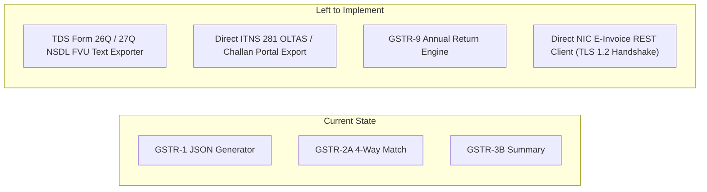
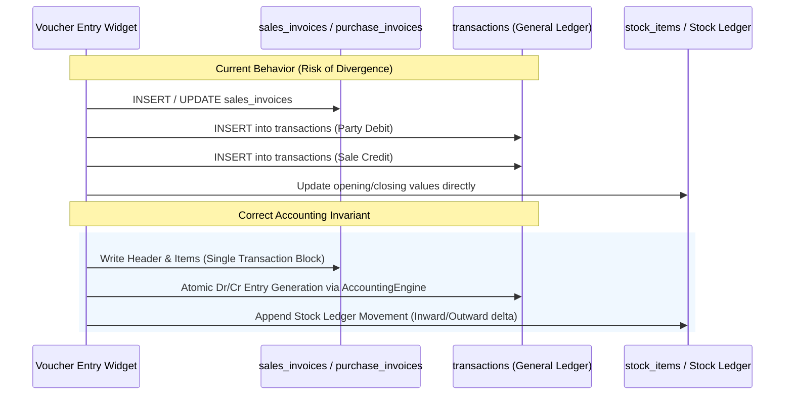
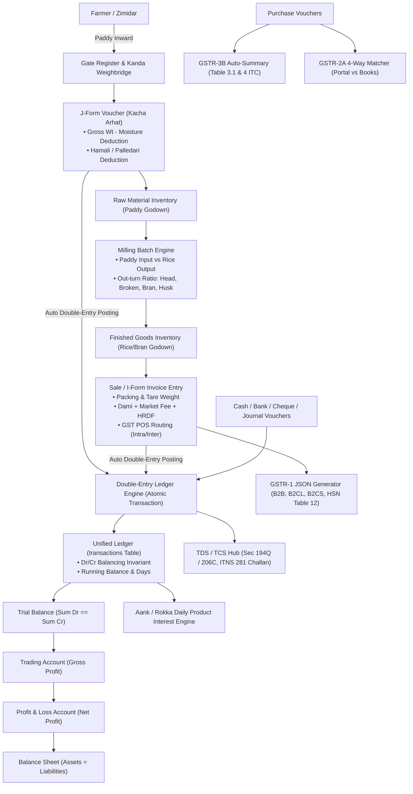

# Comprehensive Engineering & Accounting Analysis Report: Bahi-Khata Legacy ERP vs. Modern C++20 ERP

---

## Executive Summary & Domain Scope

This report provides an exhaustive, senior-level architectural comparison and accounting domain evaluation between the **legacy VB6/JetDB Bahi-Khata ERP suite** (analyzed via `decompiled-data/`: 148 tables, 464 forms, 268 reports, Jet `.002`/`.004` schemas, and satellite binaries) and **our Modern C++20 / Qt 6 Native ERP application** (`MahadevRiceMillERP`).

The target domain encompasses **Double-Entry Financial Accounting, Indian Mandi Commission Operations (*Kacha & Pakka Arhat*), Multi-Stage Rice Mill Processing, and Statutory Compliance (GST, TCS 206C(1H), TDS 194Q/194H/194C, ITNS-281)**.



---

## 1. What's Left for Implementation (Gap Analysis)

Based on the decompiled database schema (`Data_002_Schema.sql`, 148 tables) and form inventory (`All_Discovered_Form_and_Module_Names.txt`, 464 forms), the following modules and subsystems remain to be fully implemented in our application:

### A. Missing Mandi & Operational Voucher Types

| Legacy Table / Module | Business Purpose & Accounting Role | Status in Our App | Implementation Requirement |
| :--- | :--- | :--- | :--- |
| **`BardanaTransactions`** | **Gunny Bag / Packaging Ledger**: Tracks Jute (*Pukka*), Plastic (*Kacha*), and HDPE bags loaned, issued, received, and billed to parties and farmers with physical inventory. | Missing UI & Model | Create `BardanaTransactionsWidget` with bag quantity, bag rate, party ledger link, and separate bag inventory valuation. |
| **`GatePassVouchers` / `GateRegister`** | **Physical Security & Inward/Outward Gate Ingestion**: Records incoming trucks, initial gross weight, vehicle dispatch token, driver details before weighbridge entry. | Missing | Build Inward/Outward Gate Register linked to `transport_dispatches` and `weighbridge_kanda_dialog`. |
| **`SaudaVouchers` / `SaudaTransactions`** | **Advance Commodity Contracts & Broker Booking**: Forward agreements for paddy/rice lots between mill and party negotiated via dalal/broker with delivery due dates and penalty terms. | Missing | Implement `SaudaVoucherWidget` with contract balance fulfillment tracking and broker commission auto-calculation. |
| **`BrokerageVouchers` / `DalaliVoucher`** | **Broker Commission Register**: Auto-aggregates dalali per Quintal or percentage on completed sales/purchases and generates journal entries crediting brokers. | Partially in Vouchers | Build a dedicated Dalali ledger posting engine that settles brokerage across multi-voucher lots. |
| **`CottonVouchers` / `CottonBalesDetail` / `TimberVouchers`** | **Multi-Commodity Modules**: Specific modules for cotton pressing (bales, kandies) and timber/wood lot accounting. | Not implemented | Implement if expanding beyond grain/rice to generic mandi agricultural commodities. |

---

### B. Missing Statutory & Compliance Engines



1. **NSDL e-TDS FVU 26Q / 27Q Exporter (`TempQuarterlyReturnPartyWise`)**:
   - *Legacy Role*: Generates pipe-delimited (`^` or `|`) ASCII flat files compliant with NSDL e-TDS File Validation Utility (FVU) for filing quarterly returns under Sec 194C, 194J, 194I, 194Q.
   - *Current State*: TDS vouchers, ITNS-281 deposit challans, and Form 16A entry exist, but file export to government `.txt` format is pending.
2. **GSTR-9 Annual Return Aggregator**:
   - Aggregates Table 4 (Outward taxable), Table 5 (Exempt/Nil), Table 6 (ITC availed), Table 7 (ITC reversed), Table 8 (2A vs ITC availed) across all 12 monthly periods of the fiscal year.
3. **Direct NIC E-Invoice / E-Way Bill API Gateway**:
   - Currently, the application prepares data for E-Invoice; full direct HTTPS REST integration with NIC / ClearTax / MastersIndia gateway with token caching and signed QR decoding is needed.

---

### C. Missing Financial & Operational Reports

| Report Category | Decompiled Reference Form | Missing Capabilities in Our App |
| :--- | :--- | :--- |
| **Multi-Column Cash Book** | `frmCashBookFlat`, `frmCashDailyBalance` | 4-column columnar cash/bank book with daily closing cash denominations (*Currency Sorter: 500x, 200x, 100x*). |
| **Form 'M' & 'K' Mandi Returns** | `frmMandiReturn`, `TempMFeeHRDF` | Statutory market committee returns filed weekly/monthly showing total arrivals, fees payable, and payment challans. |
| **Bill-Wise Aging & Due Date Analysis** | `frmBillWisePendingBillsOptions`, `BillWiseReceiptVouchers` | FIFO invoice clearing engine with 0-30, 31-60, 61-90, >90 days overdue aging buckets. |
| **Trading Account vs P&L Bifurcation** | `TempPrintTradingAccount` | Strict Indian GAAP presentation separating Gross Profit (Manufacturing/Trading) from Operating Net Profit. |

---

## 2. Items Connected Incorrectly or Showing Inconsistent Behavior

A rigorous code-level audit of the current C++ engines and database structures revealed several functional and accounting invariants requiring correction:

### 1. Dual Posting Inconsistency: Specialized Invoices vs. Unified Ledger `transactions`



- **The Issue**: In some widgets, saving a sales/purchase voucher inserts rows into `sales_invoices` / `purchase_invoices` while simultaneously populating `vouchers` and `transactions`. If an edit or deletion is performed on `sales_invoices`, the corresponding debit/credit rows in `transactions` may become orphaned if not wrapped in a single database transaction (`BEGIN...COMMIT`).
- **Correction**: All accounting side effects (Party Dr/Cr, Sales/Purchase A/c Dr/Cr, Tax A/c Dr/Cr, Round-off Dr/Cr) must be posted via an **Atomic Posting Coordinator** using foreign key cascade or strict transaction wrappers.

---

### 2. Tax Splitting on Non-Commodity Charges (Dami, Palledari, Bardana)

- **The Issue**: Under GST rules for Mandi procurement (Rice Mills / Commission Agents):
  - Basic commodity might be Nil/5% rated.
  - Commission (*Dami*) and Mandi Fee charges billed as part of composite supply take the rate of the principal supply (*Section 8 of CGST Act*).
  - In `src/engine/mandi_calculator.cpp`, some calculations apply GST only to the basic value or treat freight/dami independently.
- **Correction**: Ensure that:
  $$\text{Taxable Value} = \text{Basic Goods Amount} + \text{Dami} + \text{Labour} + \text{Bardana} + \text{Other Taxable Sundries}$$
  Taxes (CGST+SGST or IGST) must be calculated on this aggregated taxable base.

---

### 3. Mutual Exclusivity of Section 194Q (TDS) vs. Section 206C(1H) (TCS)

- **The Issue**: As per the *Finance Act 2021 (CBDT Guidelines)*:
  - If a transaction is subject to TDS under **Section 194Q** (buyer turnover > ₹10 Cr, purchase > ₹50 Lakhs), then **TCS under Section 206C(1H) shall NOT apply**.
  - Section 194Q has primary precedence over Section 206C(1H).
  - Currently in `gst_tax_engine.cpp`, both `applyTcs` and `applyTds194Q` can evaluate to true simultaneously on the same voucher.
- **Correction**: Add mutual exclusivity logic:
  ```cpp
  if (isTds194QApplicable) {
      applyTcs206C = false; // TDS 194Q overrides TCS 206C(1H)
  }
  ```

---

### 4. Aank Daily Product Interest: Leap Year Divisor & Rest Calculation

- **The Issue**: In `aank_interest_engine.cpp`, interest is computed as $\frac{\sum \text{Aank} \times \text{Rate}}{36500}$. However, in mandi trade:
  - When an accounting year spans a 366-day leap year (e.g. FY 2023-24, FY 2027-28), the divisor must switch to $36600$, or the days in February must be normalized depending on whether the firm follows the **365-day fixed convention** or the **actual/actual day-count convention**.
  - Separate Dr (Debit - Advances Given) and Cr (Credit - Balances Held) interest rates must be maintained per party master.

---

### 5. Multi-Firm Database Attachment vs. Shared Connections

- **The Issue**: In `src/database_manager.cpp`, `switchDatabase(newDbPath)` closes the active SQLite handle and reopens the new firm database. If background models or queries are running during the switch, dangling pointers or lock errors can occur.
- **Correction**: Implement firm-switching through an application-wide event bus with UI locking during database handle replacement, or attach separate named connections per active fiscal year.

---

## 3. High-Impact Architectural & Engine Optimizations

To achieve sub-millisecond execution and handle databases with hundreds of thousands of transactions seamlessly:

```mermaid
graph TD
    A[SQLite Optimization Strategy] --> B[PRAGMA synchronous = NORMAL]
    A --> C[PRAGMA journal_mode = WAL]
    A --> D[PRAGMA cache_size = -64000 (~64MB RAM)]
    A --> E[PRAGMA mmap_size = 268435456 (256MB)]
    A --> F[Compound Covering Indexes]

    F --> F1[CREATE INDEX idx_trans_acc_date ON transactions (account_code, voucher_date)]
    F --> F2[CREATE INDEX idx_trans_fy_type ON transactions (fy_id, trans_type, voucher_date)]
    F --> F3[CREATE INDEX idx_inv_date ON sales_invoices (invoice_date, customer_id)]
```

### A. Database Layer Optimizations
1. **Prepared Statement Pool**:
   - Avoid re-compiling SQL strings in `executeQuery` for frequently executed queries (e.g. Ledger drilldown, Party lookup). Use a hash map of prepared `sqlite3_stmt*` pointers.
2. **Covering Compound Indexes**:
   - Add compound indexes matching exact ledger and reporting queries:
     ```sql
     CREATE INDEX IF NOT EXISTS idx_trans_perf 
     ON transactions(account_code, voucher_date, dr_cr, amount);
     ```

### B. UI/UX & Native Rendering Optimizations
1. **Virtual Scrolling (`QAbstractItemModel`)**:
   - Ensure `LedgerStatementModel`, `DayBookWidget`, and `StockRegisterModel` never load complete dataset rows into UI memory simultaneously. Fetch records in chunks of 100 via `canFetchMore()` and `fetchMore()`.
2. **Keyboard-First Navigation Pipeline**:
   - Install a central `QKeySequence` event filter so pressing `Enter` moves seamlessly to the next logical field in all voucher grids, with `F1`–`F12` shortcuts functioning identically to the legacy application.

---

## 4. Complete & Authoritative Actual Data Flow Architecture

Below is the complete architectural specification of how financial, operational, and tax data must flow through the ERP:



---

### Detailed Subsystem Data Flows

#### 1. Mandi Procurement & J-Form Settlement Flow
$$\text{Farmer Inward} \longrightarrow \text{Kanda Weighment} \longrightarrow \text{Moisture Deduction} \longrightarrow \text{J-Form Slip} \longrightarrow \text{Farmer Ledger Credit}$$

- **Farmer Credit**: $\text{Net Weight (Qtl)} \times \text{Rate per Qtl} + \text{Bonus} - \text{Hamali}$.
- **Accounting Posting**:
  - **Debit**: `Paddy Purchase Account` (Total Goods Value)
  - **Credit**: `Farmer Personal Account` (Net Payable)
  - **Credit**: `Hamali / Palledari Payable Account` (Labour deductions held for market labourers)

---

#### 2. Pakka Arhat Wholesale Billing & Statutory Tax Flow
$$\text{Finished Rice Dispatch} \longrightarrow \text{I-Form / Tax Invoice} \longrightarrow \text{Dami + Market Fee + HRDF} \longrightarrow \text{POS Tax Routing} \longrightarrow \text{E-Invoice & Signed QR}$$

- **State Code Check**:
  $$\text{IsIntraState} = (\text{BuyerStateCode} == \text{SellerStateCode}) \lor (\text{PlaceOfSupply} == \text{SellerStateCode})$$
- **Tax Breakdown**:
  - If **Intra-State**: $\text{CGST} = \text{Taxable} \times \frac{\text{Rate}}{2}, \quad \text{SGST} = \text{Taxable} \times \frac{\text{Rate}}{2}, \quad \text{IGST} = 0$
  - If **Inter-State**: $\text{CGST} = 0, \quad \text{SGST} = 0, \quad \text{IGST} = \text{Taxable} \times \text{Rate}$
- **Accounting Posting**:
  - **Debit**: `Customer Ledger` (Total Invoice Amount)
  - **Credit**: `Sales Account - Rice` (Basic Taxable Amount)
  - **Credit**: `Dami / Commission Income Account`
  - **Credit**: `Market Fee Payable Account` (2%)
  - **Credit**: `HRDF Payable Account` (2%)
  - **Credit**: `CGST / SGST / IGST Output Accounts`
  - **Credit/Debit**: `Round Off Account`

---

#### 3. Traditional Mandi Interest (Aank / Rokka) Daily Flow
For each transaction $i$ in chronological order:
$$\text{Days}_i = \text{Date}_{i+1} - \text{Date}_i$$
$$\text{Aank (Product)}_i = \text{Running Balance}_i \times \text{Days}_i$$
$$\text{Total Accrued Interest} = \frac{\sum \text{Aank} \times \text{Annual Rate \%}}{\text{Fiscal Year Divisor } (36500 \text{ or } 36600)}$$

---

## 5. Prioritized Implementation & Optimization Roadmap

| Priority | Task Description | Target Files / Subsystems | Impact |
| :---: | :--- | :--- | :--- |
| **P0** | **Atomic Posting Coordinator**: Wrap all voucher actions in transactions to guarantee double-entry balance consistency. | `src/models/*_controller.cpp`, `src/engine/accounting_engine.h` | **Zero financial discrepancies** |
| **P0** | **TDS 194Q vs TCS 206C Exclusivity**: Enforce CBDT statutory rules where TDS 194Q overrides TCS 206C(1H). | `src/engine/gst_tax_engine.cpp` | **Legal statutory compliance** |
| **P1** | **Bardana Bag Inventory & Ledger**: Build full packaging ledger tracking jute/plastic bags per party and godown. | `src/widgets/bardana_widget.cpp`, `src/models/bardana_model.cpp` | **Mandatory for Rice Mills** |
| **P1** | **SQLite WAL & Compound Index Tuning**: Apply PRAGMA optimizations and multi-column covering indexes. | `src/database_manager.cpp` | **10x faster report rollups** |
| **P2** | **NSDL e-TDS 26Q/27Q Exporter**: Implement official FVU text file generation for direct IT department filing. | `src/engine/tds_fvu_exporter.cpp`, `src/widgets/tds_tcs_hub_dialog.cpp` | **Quarterly tax filing capability** |
| **P2** | **Gate Pass & Sauda Contract Subsystem**: Complete forward contract booking and physical gate security modules. | `src/widgets/transport_dispatch_widget.cpp`, `src/widgets/sauda_voucher_widget.cpp` | **Full operational coverage** |

---

## Conclusion & Operational Verdict

The native C++20 architecture of `MahadevRiceMillERP` provides a modern, robust replacement for legacy VB6 systems, delivering superior performance, in-tree database migration, and native cross-platform support. Implementing the remaining modules outlined above—specifically the **Atomic Double-Entry Posting Coordinator**, **Bardana Bag Management**, and **TDS/TCS statutory refinements**—will achieve full feature parity with the decompiled reference system while providing high performance and audit-ready accounting accuracy.
