# Pure Native C++20 & QtWidgets Bahi-Khata ERP: Architecture & Master Plan

## 1. Executive Summary & System Mandate

The goal is to build a **100% Native Compiled, High-Performance Enterprise ERP & Accounting Engine in Modern C++20 using Qt 6 QtWidgets** (completely independent of QML and external Python runtimes).

This native application replicates and surpasses the functionality of the legacy VB6/JetDB `Bahi_Khata.exe` suite (148 tables, 464 forms, 268 reports, Mandi commission math, Aank daily product interest, and GSTR/E-Invoice compliance) with sub-millisecond execution, zero garbage collection overhead, instant keyboard-driven navigation (`Enter` key advancement, `F1`–`F12` shortcuts), and native desktop look-and-feel.

```mermaid
flowchart TB
    subgraph UI_Layer["1. Pure Native Qt6 QtWidgets UI Layer (Zero QML)"]
        MainWindow["MainWindow (MDI / Native Tabbed Workspace)"]
        VoucherViews["Voucher Entry Widgets\n(Sales, Purchase, J-Form, I-Form, Cash, Cheque, Journal)"]
        LedgerViews["Ledger & Financial Widgets\n(Ledger Statement with Aank, DayBook, Trial Balance, B-Sheet, P&L)"]
        GstrViews["GST Compliance Widgets\n(GSTR-1 Export, 4-Way GSTR-2A Match, GSTR-3B Summary)"]
        MillingViews["Milling & Stock Widgets\n(Paddy Procurement, Batch Milling, Out-turn Statement)"]
    end

    subgraph Core_Engine["2. Native C++20 High-Performance Business Engine"]
        MandiCalc["MandiCalculator (Dami, Mandi Shulk, HRDF, RDF, Palledari, Bardana)"]
        AankEngine["AankInterestEngine (Daily Product Bal * Days * Rate / 36500)"]
        GstEngine["GstTaxEngine (POS 2-digit routing, TCS 206C, TDS 194Q, RCM)"]
        GstrEngine["GstrComplianceEngine (GSTR-1 JSON, 4-Way 2A Match, GSTR-3B)"]
        EInvEngine["EInvoiceEngine (NIC INV-01 Schema v1.1, ZXing Signed QR)"]
        MillingEngine["MillingYieldEngine (Paddy to Head, Broken, Bran, Husk Ratios)"]
        DoubleEntryEngine["DoubleEntryLedgerEngine (Dr/Cr Posting Invariants, Multi-Year Rollover)"]
    end

    subgraph Data_Layer["3. In-Tree Storage & MDB Ingestion (Pure C/C++)"]
        SQLiteCore["Embedded SQLite 3 (WAL Mode, In-Memory Caching, Prepared Stmt Pool)"]
        LibMdbCore["Embedded libmdb (Direct 100% In-Tree C JetDB .002 / .018 Parser)"]
        FirmMgr["Multi-Firm & Fiscal Year Manager (Dynamic DB Attach / Switching)"]
    end

    UI_Layer --> Core_Engine
    Core_Engine --> Data_Layer
```



---

## 2. Comprehensive Gap Analysis: Decompiled Reference vs Current C++ Codebase

| Feature / Domain Module | Decompiled Legacy Reference (`Bahi_Khata.exe`) | Current C++ Codebase State (`src/`) | Gap Severity | Native C++ Implementation Plan |
| :--- | :--- | :--- | :--- | :--- |
| **Mandi Commission & Cess Engine** | Full calculation of Dami (Commission %), Mandi Fee (2%), HRDF (2%), RDF, Palledari (Handling per bag/qtl), Sieving (Chhanni), Loading/Unloading (Utrai), Bardana bag accounting, with per-head rounding switches. | `accounting_engine.h` has basic moisture deduction and simple gross/net weight. Lacks Dami, Mandi Shulk, HRDF, RDF, and expense round-off rules. | **CRITICAL** | Build `src/engine/mandi_calculator.h` & `mandi_calculator.cpp` implementing exact state agricultural marketing board rules and expense breakdowns. |
| **Aank / Rokka Traditional Interest** | Daily product calculation: $\text{Aank} = \text{Running Bal} \times \text{Days}$; $\text{Interest} = \frac{\sum \text{Aank} \times \text{Rate}}{36500}$; Simple & Compound interest across flexible rest periods; separate Dr/Cr interest rates. | Missing in C++ engine. `interest_model.cpp` has a basic placeholder query without full daily product math. | **CRITICAL** | Build `src/engine/aank_interest_engine.h` & `aank_interest_engine.cpp` with daily product accumulation, multi-year leap-year handling, and statement generation. |
| **GST Tax Engine & POS Routing** | 2-digit State Code POS routing (Intra-State CGST+SGST vs Inter-State IGST); Section 206C(1H) TCS (0.1% above ₹50L turnover); Section 194Q TDS (0.1%); RCM (Sec 9(3)/9(4)); Blocked ITC (Sec 17(5)). | Basic 5% tax helper. Missing automated POS state routing, TCS 206C(1H), TDS 194Q, and RCM flags. | **HIGH** | Build `src/engine/gst_tax_engine.h` & `gst_tax_engine.cpp` with full GSTIN validation, State Code extraction, and TCS/TDS threshold trackers. |
| **GSTR-1 JSON Generator** | Generates official Government GST Offline Utility JSON payloads: Tables 4A/B/C (B2B), 5A/B (B2CL), 7 (B2CS), 8 (Nil/Exempt), 9B (CDNR/CDNUR), 12 (HSN), 13 (Docs Issued). | Completely absent in C++. | **HIGH** | Build `src/engine/gstr1_engine.h` & `gstr1_engine.cpp` utilizing `QJsonDocument` to produce 100% schema-valid GSTR-1 JSON and CSV/Excel exports. |
| **GSTR-2A / 2B 4-Way Reconciliation** | 4-Way matching algorithm: matches supplier GSTIN, normalized invoice string (stripping `/`, `-`, leading zeros), and checks taxable/tax tolerance $\le \pm 1.00$. Outputs `MATCHED`, `VALUE_MISMATCH`, `NOT_IN_BOOKS`, `NOT_IN_PORTAL`. | Completely absent in C++. | **HIGH** | Build `src/engine/gstr2_reconciler.h` & `gstr2_reconciler.cpp` with string normalization, tolerance matching, and interactive reconciliation widget. |
| **GSTR-3B Monthly Auto-Summary** | Auto-computes Table 3.1 (Outward taxable, zero-rated, exempt, inward RCM) and Table 4 (Eligible ITC, Ineligible ITC Sec 17(5)). | Completely absent in C++. | **HIGH** | Build `src/engine/gstr3b_engine.h` & `gstr3b_engine.cpp`. |
| **E-Invoice Schema v1.1 & Signed QR** | Serializes vouchers into NIC Standard Schema INV-01 (v1.1) JSON payload; renders ZXing signed QR code for invoice printing. | Completely absent in C++. | **MEDIUM** | Build `src/services/einvoice_service.h` & `einvoice_service.cpp`. |
| **Paddy Milling & Out-turn Tracking** | Tracks multi-grade Paddy inputs to Head Rice (1121, 1509, PR-106, Sharbati), Broken (Tibbar, Dubar, Mongra, Kinki), Bran, Husk, with tolerance yield benchmarks and moisture variance tracking. | Basic static formula in `accounting_engine.h`; lacks multi-lot batch tracking and stock ledger integration. | **MEDIUM** | Build `src/engine/milling_yield_engine.h` & `milling_yield_engine.cpp`. |
| **Application UI Architecture (Zero QML)** | Currently uses a hybrid `QQuickWindow` container alongside QtWidgets. | `main.cpp` still loads `QQmlApplicationEngine` and bridges with `MainWindow`. | **HIGH** | Refactor `main.cpp` to launch pure native QtWidgets `MainWindow` directly, eliminating `QQmlApplicationEngine`, QML runtime overhead, and QRC QML bundling. |
| **Keyboard-First Data Entry** | Fast data entry with `Enter` navigation, `F1`–`F12` hotkeys, auto-complete party lookup with Hindi/English aliases, instant ledger drill-down. | Partial in some QtWidgets; needs systematic keyboard navigation across all voucher grids and tables. | **HIGH** | Standardize `FastTableView`, `VoucherGridTable`, and global shortcut event filters across all widgets. |

---

## 3. Mathematical & Business Logic Specifications

### 3.1 Mandi Billing & Expense Calculations
For any agricultural purchase or sale transaction:

$$\text{Gross Weight (Qtl)} = \text{Bags} \times \left(\frac{\text{Packing (Kg)}}{100.0}\right)$$
$$\text{Net Weight (Qtl)} = \text{Gross Weight} - \text{Tare Weight} - \text{Moisture Deduction}$$
$$\text{Basic Value} = \text{Net Weight} \times \text{Rate per Qtl}$$

$$\text{Dami (Commission)} = \text{Basic Value} \times \left(\frac{\text{DamiRate}}{100.0}\right)$$
$$\text{Market Fee (Mandi Shulk)} = \text{Basic Value} \times \left(\frac{\text{MarketFeeRate}}{100.0}\right)$$
$$\text{HRDF} = \text{Basic Value} \times \left(\frac{\text{HRDFRate}}{100.0}\right)$$
$$\text{RDF} = \text{Basic Value} \times \left(\frac{\text{RDFRate}}{100.0}\right)$$
$$\text{Labour (Palledari)} = \text{Bags} \times \text{LabourRatePerBag}$$
$$\text{Bardana (Gunny Bags)} = \text{Bags} \times \text{BardanaRatePerBag}$$

$$\text{Taxable Value} = \text{Basic Value} + \text{Dami} + \text{Labour} + \text{Bardana} + \text{OtherTaxableExpenses}$$

### 3.2 GST State POS & Tax Splitting
Let $\text{SellerStateCode} = \text{CompanyInfo.StateCode}$ and $\text{BuyerStateCode} = \text{AccountInfo.StateCode}$.  
$\text{IsIntraState} = (\text{BuyerStateCode} == \text{SellerStateCode}) \lor (\text{PlaceOfSupply} == \text{SellerStateCode})$.

- **If Intra-State**:
  $$\text{CGST} = \text{Round}\left(\text{Taxable Value} \times \frac{\text{TaxRate}}{2 \times 100}, 2\right)$$
  $$\text{SGST} = \text{Round}\left(\text{Taxable Value} \times \frac{\text{TaxRate}}{2 \times 100}, 2\right)$$
  $$\text{IGST} = 0.00$$
- **If Inter-State**:
  $$\text{CGST} = 0.00, \quad \text{SGST} = 0.00$$
  $$\text{IGST} = \text{Round}\left(\text{Taxable Value} \times \frac{\text{TaxRate}}{100}, 2\right)$$

$$\text{Invoice Total} = \text{Taxable Value} + \text{CGST} + \text{SGST} + \text{IGST} + \text{TCS} + \text{NonTaxableCharges} + \text{RoundOff}$$

### 3.3 Traditional Aank / Rokka Daily Product Interest
For each transaction in the account statement sorted chronologically:

$$\text{Days} = \text{Date}_{i+1} - \text{Date}_{i}$$
$$\text{Aank (Product)} = \text{Running Balance}_{i} \times \text{Days}$$
$$\text{Total Interest} = \frac{\sum \text{Aank} \times \text{Annual Interest Rate \%}}{36500}$$

*(For leap years, divisor is $36600$ if leap-year daily convention is configured).*

---

## 4. Target Native C++ Project Architecture (Zero QML)

```
src/
├── main.cpp                              (Pure QtWidgets entry point; zero QML)
├── database_manager.h / .cpp             (High-performance SQLite / WAL / LibMDB interface)
│
├── engine/                               (Core C++20 Math & Business Engines)
│   ├── mandi_calculator.h / .cpp        (Complete Mandi Commission & Cess math)
│   ├── aank_interest_engine.h / .cpp    (Aank / Rokka Daily Product calculation)
│   ├── gst_tax_engine.h / .cpp          (GST POS routing, TCS 206C, TDS 194Q)
│   ├── gstr1_engine.h / .cpp            (GSTR-1 JSON Generator & Table Aggregator)
│   ├── gstr2_reconciler.h / .cpp        (4-Way GSTR-2A Matching Engine)
│   ├── gstr3b_engine.h / .cpp           (GSTR-3B Monthly Return Engine)
│   ├── milling_yield_engine.h / .cpp    (Paddy Processing & Out-turn Engine)
│   ├── balance_sheet_calculator.h/.cpp  (Double-entry Balance Sheet Calculator)
│   ├── profit_loss_calculator.h/.cpp    (Double-entry Profit & Loss Calculator)
│   └── fiscal_year_helper.h / .cpp      (Accounting Period & Year Rollover)
│
├── models/                               (C++ QAbstractItemModel & Data Controllers)
│   ├── parties_model.h / .cpp
│   ├── stock_items_model.h / .cpp
│   ├── vouchers_model.h / .cpp
│   ├── ledger_statement_model.h / .cpp
│   ├── purchase_register_model.h / .cpp
│   ├── sales_register_model.h / .cpp
│   ├── firm_manager.h / .cpp
│   └── ...
│
├── widgets/                              (Pure Native Qt 6 QtWidgets Views)
│   ├── main_window.h / .cpp             (Primary MDI / Tabbed Container)
│   ├── sales_voucher_widget.h / .cpp    (Sale / Bikri Tax Invoice Grid)
│   ├── purchase_voucher_widget.h / .cpp (Mandi Purchase / Inward Grid)
│   ├── jform_voucher_widget.h / .cpp    (Kacha Arhat J-Form Farmer Slip)
│   ├── iform_voucher_widget.h / .cpp    (Pakka Arhat I-Form Wholesale Slip)
│   ├── journal_voucher_widget.h / .cpp  (Double-Entry Journal Voucher)
│   ├── cheque_voucher_widget.h / .cpp   (Bank Cheque / RTGS / NEFT)
│   ├── ledger_statement_widget.h / .cpp (Ledger with Running Balance & Aank)
│   ├── day_book_widget.h / .cpp         (Chronological Daily Audit Book)
│   ├── gstr_reports_widget.h / .cpp     (GSTR-1, 2A Match, 3B Dashboard)
│   ├── balance_sheet_widget.h / .cpp    (Dr/Cr Balanced Sheet with Drill-down)
│   ├── profit_loss_widget.h / .cpp      (Trading & Profit & Loss Statement)
│   ├── milling_statement_widget.h / .cpp(Milling Yield & Batch Register)
│   └── custom_dialogs.h / .cpp          (High-speed keyboard popup dialogs)
│
└── services/                             (Printing, PDF Export, E-Invoice)
    ├── print_export_controller.h / .cpp (Native QPainter High-Res PDF Generator)
    ├── einvoice_service.h / .cpp        (NIC INV-01 Payload & IRN Service)
    └── qr_code_generator.h / .cpp       (Signed QR Barcode Generator)
```

---

## 5. Phased Execution Roadmap

### Phase 1: Engine Foundation & Elimination of QML (Immediate)
1. **Refactor `src/main.cpp`**:
   - Completely remove `QQmlApplicationEngine`, `QQmlContext`, `QQuickWindow`, and QML import paths.
   - Launch pure native `MainWindow` directly as the root application window.
2. **Implement Core C++20 Business Engines**:
   - `src/engine/mandi_calculator.h / .cpp`: Dami, Mandi Fee, HRDF, RDF, Palledari, Sieving, Unloading, Bardana math with rounding switches.
   - `src/engine/aank_interest_engine.h / .cpp`: Daily product interest calculation ($\text{Aank} = \text{Bal} \times \text{Days}$).
   - `src/engine/gst_tax_engine.h / .cpp`: State POS routing, TCS 206C(1H), TDS 194Q, RCM.
   - `src/engine/milling_yield_engine.h / .cpp`: Multi-grade Paddy out-turn yield calculations.
3. **Build & Verify Automated C++ Tests**:
   - Write tests in `tests/` verifying calculations against verified `Data.002` (Mahadev) and `Data.018` (Sushil) vouchers.

### Phase 2: GSTR Compliance & Reconciliation Engines
1. **Implement `Gstr1Engine`**:
   - Build section queries for B2B, B2CL, B2CS, Nil/Exempt, CDNR/CDNUR, HSN Table 12, Document Table 13.
   - Output valid GST Offline JSON and Excel workbooks.
2. **Implement `Gstr2Reconciler`**:
   - Implement 4-way matching algorithm with string normalization and $\pm 1.00$ tolerance.
3. **Implement `Gstr3BEngine`**:
   - Auto-compute Table 3.1 outward liabilities and Table 4 eligible/ineligible ITC.
4. **Implement `GstrReportsWidget`**:
   - Interactive QtWidgets dashboard to inspect, reconcile, and export GST returns.

### Phase 3: Pure QtWidgets UI Polish & Keyboard-Driven Navigation
1. **Upgrade Voucher Widgets**:
   - Ensure `SalesVoucherWidget`, `PurchaseVoucherWidget`, `JFormVoucherWidget`, `IFormVoucherWidget` have instant `Enter` key focus traversal, calculation live-updates, and `F1`–`F12` hotkeys.
2. **Ledger Statement with Aank Column**:
   - Add toggleable `Aank` column showing daily product calculation and accrued interest in `LedgerStatementWidget`.
3. **Day Book Widget**:
   - Create `DayBookWidget` with instant date filtering, voucher type filters, and double-click voucher drill-down.

---

## 6. Verification Plan

### Automated Testing:
- Build the C++ project with `cmake -B build && cmake --build build`.
- Run comprehensive unit test suites for:
  1. `MandiCalculator`: Invariant check $\text{Invoice Total} = \text{Taxable} + \text{Taxes} + \text{Expenses} + \text{RoundOff}$.
  2. `AankInterestEngine`: Verify daily product sum $\sum \text{Aank} \times \text{Rate} / 36500$.
  3. `GstTaxEngine`: Verify Intra-State (CGST+SGST) vs Inter-State (IGST) splitting.
  4. `DoubleEntry`: Verify $\sum \text{Debits} == \sum \text{Credits}$ across all migrated firm ledgers.

### Manual Verification:
- Launch the native compiled application `./build/bin/MahadevRiceMillERP`.
- Verify instant startup (< 50ms), seamless keyboard navigation, multi-firm switching between Mahadev (`Data.002`) and Sushil (`Data.018`), and accurate ledger statements.
