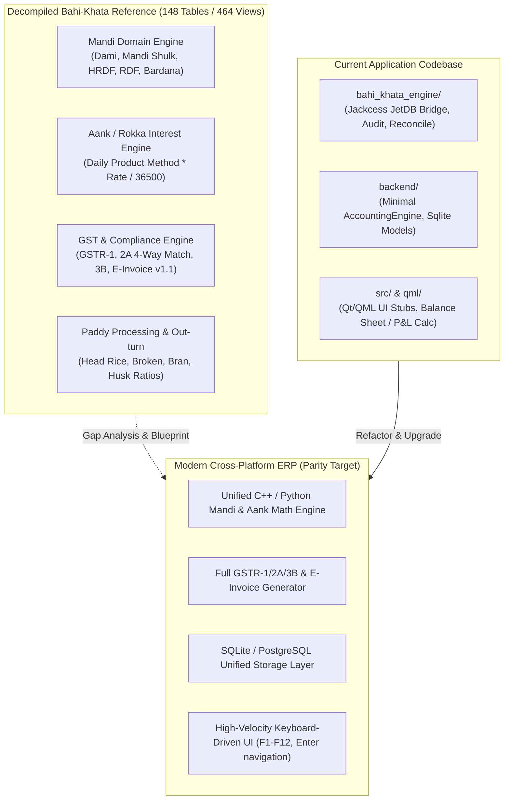
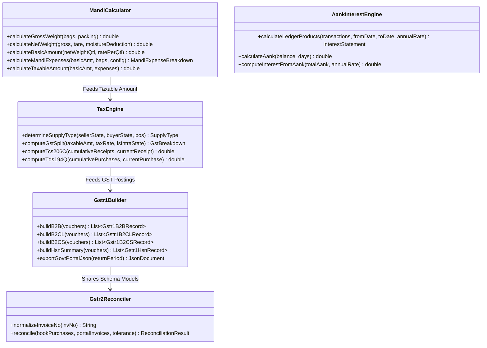

# Bahi-Khata Modernization & Architectural Parity Plan

## Executive Summary & System Overview

An exhaustive architectural extraction and reverse-engineering analysis was conducted on the decompiled legacy `Bahi_Khata.exe` (VB6 / JetDB 4.0 architecture), satellite tools (`EInvoice.exe`, `irn_qr_getter.exe`, `GSTR_Match.exe`, `SyncData.exe`), and extracted database schemas (`Data.002`, `Data.018`, `Control.lsp`).

This document provides a comparative gap analysis between the legacy Bahi-Khata reference specification and our current application codebase (`bahi_khata_engine`, `backend`, `src`, `qml`), followed by a phased engineering plan for immediate fixes and future system replication.

---

## 1. Comparative Gap Analysis Matrix

| Subsystem / Feature | Legacy Decompiled Reference | Current Workspace State | Gap Level | Action Required |
| :--- | :--- | :--- | :--- | :--- |
| **Mandi Commission & Expense Math** | Auto-computes Dami (Commission %), Mandi Fee (2%), HRDF (2%), RDF, Palledari (Labour per bag/qtl), Sieving (Chhanni), Unloading (Utrai), Bardana tare/rates, with round-off switches per head. | Only basic `moisture_deduction` and `paddy_net_amount` in `backend/accounting_engine.py` and `src/engine/accounting_engine.h`. | **CRITICAL** | Implement complete `MandiCalculator` with all state mandi cess formulas, bag weights, and expense round-off toggles. |
| **Aank / Rokka Traditional Interest** | Daily product calculation: $\text{Aank} = \text{Running Bal} \times \text{Days}$; $\text{Interest} = \frac{\sum \text{Aank} \times \text{Rate}}{36500}$; Simple & Compound interest across flexible rest periods. | Completely absent. No product calculation or interest rate tracking per ledger account. | **CRITICAL** | Build `AankInterestEngine` supporting running daily product calculations, debit/credit interest separation, and interest note generation. |
| **GST Tax Engine & POS Splitting** | Automated Intra-State (CGST + SGST split) vs Inter-State (IGST) determination via 2-digit State Codes; TCS Sec 206C(1H) (0.1% > ₹50L); TDS Sec 194Q; RCM; Blocked ITC Sec 17(5). | Hardcoded 5% sales tax calculation without State Code POS logic, TCS, TDS, or RCM handling. | **HIGH** | Build `TaxEngine` with full GSTIN validation, 2-digit POS routing, TCS 206C(1H), TDS 194Q, and RCM flags. |
| **GSTR-1 Reporting & Portal JSON** | Full generation of Table 4A/B/C (B2B), 5A/B (B2CL), 7 (B2CS), 8 (Nil/Exempt), 9B (CDNR/CDNUR), 12 (HSN), and 13 (Docs Issued) with official JSON export. | Not implemented. | **HIGH** | Build `Gstr1Builder` service producing compliant Govt GST Offline JSON payloads and exportable Excel sheets. |
| **GSTR-2A / 2B 4-Way Reconciliation** | 4-Way invoice matcher comparing books vs portal JSON: matches GSTIN, normalized invoice string, and checks taxable/tax tolerance $\le \pm 1.00$. Categorizes into `MATCHED`, `MISMATCH`, `NOT_IN_BOOKS`, `NOT_IN_PORTAL`. | Not implemented. | **HIGH** | Implement `Gstr2Reconciler` with string normalization and fuzzy invoice number matching. |
| **E-Invoice & Signed QR Subsystem** | Serializes vouchers into NIC Standard Schema INV-01 (v1.1) JSON; calls API and generates ZXing signed QR code (`irn_qr_getter.exe`). | Not implemented. | **MEDIUM** | Implement `EInvoiceClient` payload generator and QR barcode renderer. |
| **Paddy Milling & Out-turn Tracking** | Tracks multi-grade Paddy inputs to Head Rice, Broken (Tibbar, Dubar, Mongra, Kinki), Bran, Husk, with tolerance yield benchmarks and moisture variance tracking. | Basic static formula in `accounting_engine.py`; lacks multi-lot batch tracking and stock ledger integration. | **MEDIUM** | Upgrade `MillingEngine` with batch-wise yield analysis and stock item conversion postings. |
| **Database & Schema Abstraction** | 148 normalized JetDB tables (`AccountInfo`, `Transactions`, `BikriIssueVouchers`, `ItemInfo`, `VoucherSettings`, etc.). | `bahi_khata_engine` interfaces via Jackcess; C++ layer uses SQLite schema with a subset of tables. | **MEDIUM** | Standardize unified SQLite/PostgreSQL schema reflecting the full 148-table data dictionary. |
| **Keyboard-First UI / UX Navigation** | Ultra-fast data entry with `Enter` navigation, `F1`–`F12` hotkeys, auto-complete party lookup with Hindi/English aliases, instant ledger drill-down. | QML views exist for basic forms, but lack comprehensive keyboard-driven flows and mandi billing grids. | **HIGH** | Refactor QML/C++ views to support keyboard navigation (`Enter` field traversal, `F1`–`F12` global shortcuts). |

---

## 2. Detailed Technical Architecture Plan

---

## 3. Phased Implementation Roadmap

### Phase 1: Core Domain & Calculation Engine Parity (Immediate Fixes)
1. **Mandi Commission & Expense Math Module**:
   - Create `backend/mandi_engine.py` and `src/engine/mandi_calculator.h`.
   - Implement formulas: Dami %, Mandi Market Fee %, HRDF %, RDF %, Palledari (Handling), Sieving (Chhanni), Loading/Unloading (Utrai), Bardana tare and rates.
   - Support configurable rounding rules per expense type (`FirstTotalRoundOff`, `DamiRoundOff`, `MarketFeeRoundOff`, `HRDFRoundOff`, `LabourRoundOff`, `InvoiceRoundOff`).
2. **Aank / Rokka Traditional Interest Engine**:
   - Implement daily product interest engine ($\text{Aank} = \text{Balance} \times \text{Days}$).
   - Add simple vs compound interest calculations, debit/credit rate segregation, and interest statement generation.
3. **GST Tax Engine & POS Routing**:
   - Implement State Code parsing (`06` Haryana, `08` Rajasthan, `03` Punjab, etc.) to determine Intra-State (`CGST + SGST`) vs Inter-State (`IGST`).
   - Implement TCS Section 206C(1H) (threshold ₹50,00,000 at 0.1%) and TDS Section 194Q.
4. **Unit Test Suite**:
   - Write comprehensive unit tests verifying calculations against known historical bills from `Data.002` and `Data.018`.

### Phase 2: GST Compliance Subsystem (GSTR-1, GSTR-2A, GSTR-3B & E-Invoice)
1. **GSTR-1 Generator**:
   - Build section aggregators for B2B (Table 4), B2CL (Table 5), B2CS (Table 7), Nil/Exempt (Table 8), CDNR/CDNUR (Table 9B), HSN (Table 12), and Document Register (Table 13).
   - Export standard JSON format accepted by the GST Portal offline tool.
2. **GSTR-2A / 2B 4-Way Matching Engine**:
   - Implement invoice number normalization (stripping special characters, leading zeros, slashes).
   - Implement 4-way matching with $\pm ₹1.00$ tolerance on taxable and tax amounts.
   - Produce categorization: `MATCHED`, `VALUE_MISMATCH`, `NOT_IN_BOOKS`, `NOT_IN_PORTAL`.
3. **GSTR-3B Auto-Summary**:
   - Auto-calculate Table 3.1 (Outward taxable, zero-rated, exempt, inward RCM) and Table 4 (Eligible ITC, Ineligible ITC Sec 17(5)).
4. **E-Invoice Payload Builder (NIC INV-01 Schema v1.1)**:
   - Generate standard E-Invoice JSON payload for B2B invoices.
   - Integrate QR code generation for IRN signed QR verification.

### Phase 3: High-Performance Database & Cross-Platform UI Modernization
1. **Database Schema Harmonization**:
   - Modernize the 148-table schema into a high-performance SQLite / PostgreSQL schema (`schema.sqlite.sql`).
   - Ensure complete bi-directional migration between legacy JetDB (`Data.002` / `Data.018`) and modern SQLite/Postgres.
2. **Keyboard-First Billing & Voucher Views**:
   - Build Mandi Sale / Bikri Invoice form (`frmBikriVoucher`) in QML/C++ with full `Enter` key focus advancement and `F1`–`F12` hotkeys.
   - Implement interactive Ledger View with running balances, Aank products, and drill-down voucher navigation.
   - Build Day Book chronological audit view with real-time multi-criteria filtering.

---

## 4. Verification & Testing Strategy

### Automated Testing:
- **Math Verification**: Run mathematical invariant tests verifying that:
  $$\text{Invoice Total} = \text{Taxable Amount} + \text{CGST} + \text{SGST} + \text{IGST} + \text{Cess} + \text{TCS} + \text{Expenses} + \text{RoundOff}$$
- **Aank Verification**: Compare interest calculations against historical Bahi-Khata interest statements.
- **Double-Entry Balancing**: Assert $\sum \text{Debits} == \sum \text{Credits}$ across all generated vouchers.
- **GSTR-1 JSON Validation**: Validate generated JSON payloads against official GSTN JSON Schemas.

### Manual / Integration Verification:
- Cross-verify generated trial balances, ledger statements, and GSTR summaries against `Data.002` (Mahadev) and `Data.018` (Sushil Trading).
